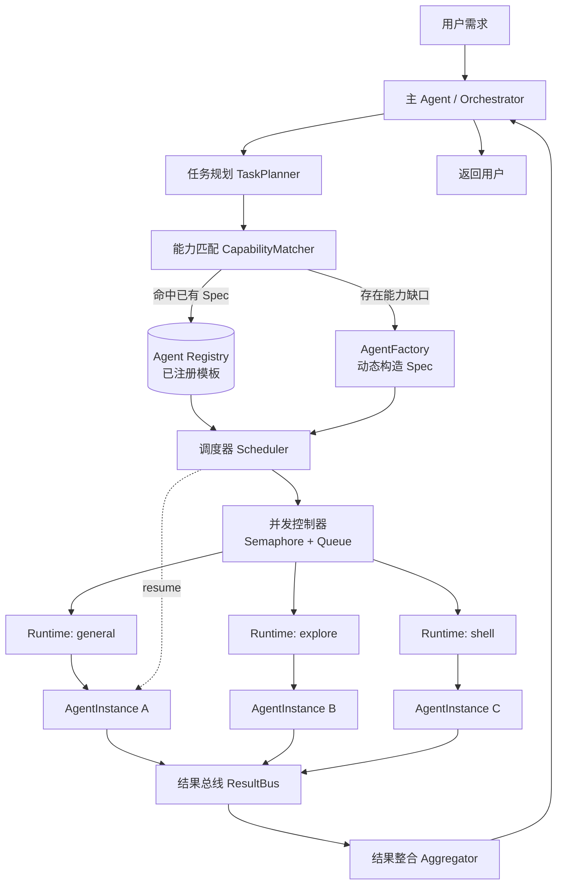
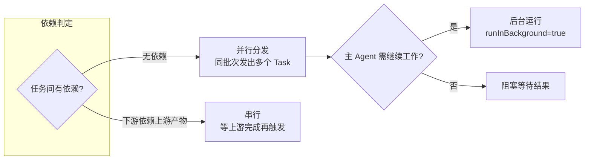

# 主 Agent 动态创建与调度自定义子 Agent

> 面向"主 Agent 如何在**已有子 Agent 不满足任务**、或**其他子 Agent 仍在运行**的情况下，动态构造并调度子 Agent"这一核心问题的完整技术设计。

## 目录

- [1. 问题定义](#1-问题定义)
- [2. 核心概念澄清：选型 vs 创建](#2-核心概念澄清选型-vs-创建)
- [3. 整体架构](#3-整体架构)
- [4. 实现原理](#4-实现原理)
  - [4.1 能力匹配与缺口检测](#41-能力匹配与缺口检测)
  - [4.2 动态子 Agent 的构造](#42-动态子-agent-的构造)
  - [4.3 调度：并行 / 后台 / 串行](#43-调度并行--后台--串行)
  - [4.4 并发控制与资源隔离](#44-并发控制与资源隔离)
- [5. 数据模型](#5-数据模型)
- [6. 关键代码实现](#6-关键代码实现)
  - [6.1 Agent 注册表 Registry](#61-agent-注册表-registry)
  - [6.2 能力匹配器 CapabilityMatcher](#62-能力匹配器-capabilitymatcher)
  - [6.3 动态 Agent 工厂 AgentFactory](#63-动态-agent-工厂-agentfactory)
  - [6.4 调度器 Scheduler](#64-调度器-scheduler)
  - [6.5 主 Agent 编排循环](#65-主-agent-编排循环)
- [7. 使用场景](#7-使用场景)
- [8. 常见陷阱与规避](#8-常见陷阱与规避)
- [9. 小结](#9-小结)

---

## 1. 问题定义

主 Agent（Orchestrator）在执行用户任务时，会遇到三类需要"派生子 Agent"的情形：

| 情形 | 描述 | 需要解决的问题 |
|------|------|----------------|
| **能力缺口** | 现有子 Agent 类型都不匹配当前任务 | 如何判定"不满足"？如何补齐能力？ |
| **并发冲突** | 目标子 Agent 已在运行，或需要同时处理多个独立任务 | 是并行再开、后台执行，还是排队串行？ |
| **上下文续跑** | 某个已完成的子 Agent 需要接着做后续步骤 | 如何复用其上下文而不重开？ |

本文给出一套可落地的调度器设计，覆盖**能力匹配 → 动态构造 → 并发调度 → 结果整合**的完整闭环。

---

## 2. 核心概念澄清：选型 vs 创建

一个常见误解是"主 Agent 凭空发明一个全新类型的子 Agent"。**实际的工程实现里，Agent 的"类型/运行时"是有限且预定义的，真正被动态定制的是它的 `spec`（提示词 + 工具集 + 约束）。**

```
        ┌─────────────────────────────────────────────┐
        │   固定的 Runtime 池（能力上限确定）           │
        │   general | explore | shell | reviewer | ... │
        └─────────────────────────────────────────────┘
                          │ 选一个 runtime
                          ▼
        ┌─────────────────────────────────────────────┐
        │   动态注入 AgentSpec（这才是"自定义"）        │
        │   - prompt（任务/角色）                       │
        │   - allowedTools（工具子集）                  │
        │   - constraints（范围/超时/预算）             │
        │   - inputContext（自包含上下文）              │
        └─────────────────────────────────────────────┘
                          │ 实例化
                          ▼
                   AgentInstance（可调度、可并发）
```

> **一句话原则：类型是选出来的，能力是组合出来的，行为是提示词定义的。**
> 所谓"创建自定义子 Agent" = 选一个足够通用的 runtime（如 `generalPurpose`）+ 组合工具集 + 注入定制 prompt。

---

## 3. 整体架构



**分层职责：**

| 层 | 组件 | 职责 |
|----|------|------|
| 编排层 | Orchestrator / TaskPlanner | 拆解用户需求为独立任务 |
| 决策层 | CapabilityMatcher / AgentFactory | 匹配已有能力，缺口时动态构造 Spec |
| 调度层 | Scheduler / 并发控制器 | 决定并行/后台/串行，管理生命周期 |
| 执行层 | Runtime + AgentInstance | 实际运行子 Agent |
| 汇聚层 | ResultBus / Aggregator | 收集、去重、冲突检测、整合 |

---

## 4. 实现原理

### 4.1 能力匹配与缺口检测

主 Agent 拿到一个任务后，先尝试从**注册表**里找匹配的 Agent 模板，而不是直接创建。匹配基于三个维度打分：

1. **能力标签匹配**（capability tags）：任务所需能力 ⊆ 模板声明能力
2. **工具需求匹配**（required tools）：任务需要的工具模板是否具备
3. **语义相似度**（可选）：任务描述与模板描述的 embedding 相似度

```
matchScore = w1 * tagCoverage + w2 * toolCoverage + w3 * semanticSim

if matchScore >= THRESHOLD  → 复用已有模板（selection）
else                        → 触发动态构造（creation）
```

**判定"不满足"的本质**：没有任何已注册模板的 `matchScore` 越过阈值，即存在**能力缺口（capability gap）**。

### 4.2 动态子 Agent 的构造

缺口出现时，`AgentFactory` 按以下步骤组合出一个新 Spec：

1. **选 runtime**：从固定池中挑选能力上界最合适的（通常是 `generalPurpose`）
2. **裁剪工具集**：按最小权限原则，只授予任务真正需要的工具（`allowedTools`）
3. **生成 prompt**：用模板 + 任务上下文渲染出**自包含**的指令（子 Agent 拿不到主 Agent 的历史）
4. **注入约束**：范围（scope）、超时、token 预算、只读/可写
5. **可选注册**：若该 Spec 未来可能复用，写回 Registry 形成"学习到的模板"

### 4.3 调度：并行 / 后台 / 串行

调度决策由**任务依赖图（DAG）**驱动：



| 模式 | 触发条件 | 行为 |
|------|----------|------|
| **并行** | 多个任务彼此独立 | 同一批次发出多个子 Agent，同时执行 |
| **后台** | 主 Agent 还有别的活要干 | 子 Agent 后台跑，完成后回调通知 |
| **串行** | B 依赖 A 的输出 | A 完成后将其产物注入 B 的上下文再启动 |
| **续跑（resume）** | 已完成的 Agent 需接着做 | 用 agentId 恢复其上下文，追加新指令 |

### 4.4 并发控制与资源隔离

- **信号量（Semaphore）**：限制同时运行的子 Agent 数，防止 token/连接耗尽
- **队列（Queue）**：超出并发上限的任务排队，空位释放后出队
- **上下文隔离**：每个子 Agent 独立上下文，避免相互污染主 Agent 的窗口
- **超时与熔断**：单个 Agent 超时自动取消；连续失败触发降级
- **幂等键**：相同 Spec + 相同输入可命中缓存，避免重复执行

---

## 5. 数据模型

```typescript
// 固定的运行时类型（能力上界确定，不可动态新增）
type RuntimeKind =
  | 'generalPurpose'
  | 'explore'
  | 'shell'
  | 'codeReviewer';

// 子 Agent 规格：这才是被"动态定制"的对象
interface AgentSpec {
  specId: string;                 // 规格唯一 ID（可由内容哈希生成，用于幂等）
  runtime: RuntimeKind;           // 选中的运行时
  role: string;                   // 角色名，如 "test-fixer"
  capabilities: string[];         // 声明的能力标签
  allowedTools: string[];         // 最小权限工具集
  promptTemplate: string;         // 提示词模板
  constraints: AgentConstraints;  // 运行约束
  origin: 'registered' | 'dynamic'; // 来自注册表还是动态构造
}

interface AgentConstraints {
  scope: string;                  // 允许触碰的范围，如某个目录/文件
  readOnly: boolean;              // 是否只读
  timeoutMs: number;              // 超时
  tokenBudget: number;            // token 预算
  maxRetries: number;
}

// 任务描述
interface TaskSpec {
  taskId: string;
  description: string;            // 自然语言目标
  requiredCapabilities: string[]; // 所需能力标签
  requiredTools: string[];        // 所需工具
  inputContext: Record<string, unknown>; // 自包含上下文
  dependsOn: string[];            // 依赖的上游 taskId（构成 DAG）
  priority: number;
}

// 运行中的实例
type AgentStatus = 'queued' | 'running' | 'succeeded' | 'failed' | 'cancelled';

interface AgentInstance {
  instanceId: string;
  spec: AgentSpec;
  task: TaskSpec;
  status: AgentStatus;
  startedAt?: number;
  finishedAt?: number;
  result?: AgentResult;
  parentAgentId: string;          // 主 Agent ID，用于溯源
  runInBackground: boolean;
}

interface AgentResult {
  summary: string;                // 给主 Agent 的高层摘要
  artifacts: Record<string, unknown>; // 结构化产物（供下游依赖消费）
  tokensUsed: number;
  error?: string;
}
```

**实体关系：**

```
TaskSpec ──(matcher)──> AgentSpec ──(factory/registry)──> AgentInstance ──> AgentResult
   │                                                              │
   └───────────────── dependsOn (DAG) ───────────────────────────┘
```

---

## 6. 关键代码实现

### 6.1 Agent 注册表 Registry

```typescript
class AgentRegistry {
  private specs = new Map<string, AgentSpec>();

  register(spec: AgentSpec): void {
    this.specs.set(spec.specId, spec);
  }

  list(): AgentSpec[] {
    return [...this.specs.values()];
  }

  get(specId: string): AgentSpec | undefined {
    return this.specs.get(specId);
  }
}
```

### 6.2 能力匹配器 CapabilityMatcher

```typescript
interface MatchOutcome {
  spec: AgentSpec | null;
  score: number;
  gap: boolean; // 是否存在能力缺口
}

class CapabilityMatcher {
  constructor(
    private registry: AgentRegistry,
    private threshold = 0.75,
  ) {}

  match(task: TaskSpec): MatchOutcome {
    let best: AgentSpec | null = null;
    let bestScore = 0;

    for (const spec of this.registry.list()) {
      const score = this.score(task, spec);
      if (score > bestScore) {
        bestScore = score;
        best = spec;
      }
    }

    const gap = bestScore < this.threshold;
    return { spec: gap ? null : best, score: bestScore, gap };
  }

  private score(task: TaskSpec, spec: AgentSpec): number {
    const tagCoverage = this.coverage(task.requiredCapabilities, spec.capabilities);
    const toolCoverage = this.coverage(task.requiredTools, spec.allowedTools);
    // 语义相似度可接入 embedding，这里简化为标签覆盖
    return 0.6 * tagCoverage + 0.4 * toolCoverage;
  }

  private coverage(required: string[], provided: string[]): number {
    if (required.length === 0) return 1;
    const set = new Set(provided);
    const hit = required.filter((r) => set.has(r)).length;
    return hit / required.length;
  }
}
```

### 6.3 动态 Agent 工厂 AgentFactory

```typescript
import { createHash } from 'crypto';

class AgentFactory {
  constructor(private registry: AgentRegistry) {}

  // 能力缺口时：组合出一个新的自定义 Spec
  create(task: TaskSpec): AgentSpec {
    const runtime = this.pickRuntime(task);
    const allowedTools = this.minimalTools(task.requiredTools);
    const promptTemplate = this.buildPrompt(task);

    const spec: AgentSpec = {
      specId: this.hash(runtime, task),
      runtime,
      role: `dynamic:${task.taskId}`,
      capabilities: task.requiredCapabilities,
      allowedTools,
      promptTemplate,
      constraints: {
        scope: (task.inputContext.scope as string) ?? '.',
        readOnly: false,
        timeoutMs: 5 * 60 * 1000,
        tokenBudget: 200_000,
        maxRetries: 1,
      },
      origin: 'dynamic',
    };

    // 可选：把学到的模板写回注册表，供后续复用
    this.registry.register(spec);
    return spec;
  }

  private pickRuntime(task: TaskSpec): RuntimeKind {
    if (task.requiredTools.includes('shell')) return 'shell';
    if (task.requiredCapabilities.includes('code-search')) return 'explore';
    if (task.requiredCapabilities.includes('review')) return 'codeReviewer';
    return 'generalPurpose'; // 兜底：能力最通用
  }

  private minimalTools(required: string[]): string[] {
    // 最小权限：只授予任务真正需要的工具
    return [...new Set(required)];
  }

  private buildPrompt(task: TaskSpec): string {
    // 子 Agent 拿不到主 Agent 历史 → prompt 必须自包含
    return [
      `# 角色\n你是一个专注的子 Agent，只负责如下单一任务。`,
      `# 目标\n${task.description}`,
      `# 上下文\n${JSON.stringify(task.inputContext, null, 2)}`,
      `# 约束\n仅在指定 scope 内操作，完成后返回结构化摘要 { summary, artifacts }。`,
    ].join('\n\n');
  }

  private hash(runtime: RuntimeKind, task: TaskSpec): string {
    return createHash('sha1')
      .update(runtime + task.description + task.requiredTools.join(','))
      .digest('hex')
      .slice(0, 12);
  }
}
```

### 6.4 调度器 Scheduler

```typescript
type Runner = (instance: AgentInstance) => Promise<AgentResult>;

class Scheduler {
  private running = new Set<string>();
  private queue: AgentInstance[] = [];
  private results = new Map<string, AgentResult>();

  constructor(
    private runner: Runner,
    private maxConcurrency = 4,
  ) {}

  // 依赖 DAG 驱动的批量调度入口
  async dispatch(instances: AgentInstance[]): Promise<Map<string, AgentResult>> {
    const pending = new Map(instances.map((i) => [i.task.taskId, i]));
    const done = new Set<string>();

    while (done.size < instances.length) {
      // 找出依赖已满足、可执行的任务 → 并行分发
      const ready = [...pending.values()].filter(
        (i) =>
          !this.running.has(i.instanceId) &&
          !done.has(i.task.taskId) &&
          i.task.dependsOn.every((dep) => done.has(dep)),
      );

      if (ready.length === 0 && this.running.size === 0) {
        throw new Error('检测到依赖环或无法推进的任务');
      }

      // 将上游产物注入下游上下文
      for (const inst of ready) {
        inst.task.inputContext.upstream = this.collectUpstream(inst);
      }

      await Promise.all(
        ready
          .filter(() => this.running.size < this.maxConcurrency)
          .map((inst) => this.runOne(inst, pending, done)),
      );
    }
    return this.results;
  }

  private async runOne(
    inst: AgentInstance,
    pending: Map<string, AgentInstance>,
    done: Set<string>,
  ): Promise<void> {
    this.running.add(inst.instanceId);
    inst.status = 'running';
    inst.startedAt = Date.now();
    try {
      const result = await this.withTimeout(
        this.runner(inst),
        inst.spec.constraints.timeoutMs,
      );
      inst.status = 'succeeded';
      inst.result = result;
      this.results.set(inst.task.taskId, result);
    } catch (e) {
      inst.status = 'failed';
      inst.result = { summary: 'failed', artifacts: {}, tokensUsed: 0, error: String(e) };
    } finally {
      inst.finishedAt = Date.now();
      this.running.delete(inst.instanceId);
      done.add(inst.task.taskId);
      pending.delete(inst.task.taskId);
    }
  }

  private collectUpstream(inst: AgentInstance): Record<string, unknown> {
    const upstream: Record<string, unknown> = {};
    for (const dep of inst.task.dependsOn) {
      upstream[dep] = this.results.get(dep)?.artifacts;
    }
    return upstream;
  }

  private withTimeout<T>(p: Promise<T>, ms: number): Promise<T> {
    return Promise.race([
      p,
      new Promise<T>((_, rej) => setTimeout(() => rej(new Error('timeout')), ms)),
    ]);
  }
}
```

### 6.5 主 Agent 编排循环

把上面组件串起来——这正是"用户需求 → 判定缺口 → 动态构造 → 调度"的主线：

```typescript
class Orchestrator {
  constructor(
    private planner: { plan(input: string): TaskSpec[] },
    private matcher: CapabilityMatcher,
    private factory: AgentFactory,
    private scheduler: Scheduler,
    private parentAgentId: string,
  ) {}

  async handle(userInput: string): Promise<string> {
    // 1. 拆解为独立任务（可能构成依赖 DAG）
    const tasks = this.planner.plan(userInput);

    // 2. 为每个任务选型或动态构造子 Agent
    const instances: AgentInstance[] = tasks.map((task) => {
      const outcome = this.matcher.match(task);

      const spec = outcome.gap
        ? this.factory.create(task) // 能力缺口 → 动态创建自定义 Spec
        : outcome.spec!;            // 命中已有模板 → 复用

      return {
        instanceId: `${task.taskId}-${Date.now()}`,
        spec,
        task,
        status: 'queued',
        parentAgentId: this.parentAgentId,
        // 有下游依赖它的任务则前台阻塞，否则可后台
        runInBackground: task.dependsOn.length === 0,
      };
    });

    // 3. 依赖驱动的并发调度（并行/串行由 DAG 决定）
    const results = await this.scheduler.dispatch(instances);

    // 4. 整合结果
    return this.aggregate(results);
  }

  private aggregate(results: Map<string, AgentResult>): string {
    const parts = [...results.entries()].map(
      ([taskId, r]) => `- [${taskId}] ${r.error ? '❌ ' + r.error : r.summary}`,
    );
    return `任务完成情况:\n${parts.join('\n')}`;
  }
}
```

---

## 7. 使用场景

| 场景 | 触发的机制 | 调度模式 |
|------|-----------|----------|
| 修复 3 个根因不同的失败测试 | 已有 `test-fixer` 模板复用 | 并行 |
| 需要一个仓库从没做过的"性能剖析"任务 | 无匹配模板 → **动态构造** `perf-profiler` Spec | 后台 |
| 先探索代码结构，再据此重构 | 探索任务与重构任务有依赖 | 串行（explore → refactor）|
| 主 Agent 正在写代码，同时想让人跑一遍安全审查 | 目标 reviewer 空闲/复用模板 | 后台并行 |
| 某个子 Agent 已完成，需要基于其发现继续深挖 | `resume` 恢复上下文 | 续跑 |
| 一次性做 5 个独立子系统的健康检查 | 5 个独立任务 | 并行 + 信号量限流 |

**决策口诀：**

```
匹配得分够高?  ──是──> 复用注册模板
     │否
     ▼
动态构造 Spec（选 runtime + 裁工具 + 写 prompt）
     │
     ▼
任务间有依赖?  ──否──> 并行（+ 需要主 Agent 继续干活则后台）
     │是
     ▼
按 DAG 串行，上游产物注入下游上下文
```

---

## 8. 常见陷阱与规避

| 陷阱 | 后果 | 规避 |
|------|------|------|
| 以为能"发明"新 runtime | 设计不可实现 | 明确 runtime 有限，定制的是 Spec |
| 子 Agent prompt 不自包含 | 子 Agent 缺乏上下文、跑偏 | prompt 必须包含全部所需上下文 |
| 无并发上限 | token / 连接耗尽 | 信号量 + 队列限流 |
| 依赖图有环 | 调度死锁 | 调度前做拓扑排序校验 |
| 授予子 Agent 全量工具 | 越权、误操作 | 最小权限，只给必要工具 |
| 并行任务其实有共享状态 | 结果相互覆盖、冲突 | 拆分前先确认"真独立"；整合阶段做冲突检测 |
| 无超时/熔断 | 单个 Agent 卡死拖垮整体 | 每个实例独立超时 + 重试上限 |
| 动态 Spec 每次都重建 | 重复开销、无法复用 | 内容哈希做幂等键，学到的模板写回注册表 |

---

## 9. 小结

1. **"创建自定义子 Agent"的本质是选型 + 组合**：runtime 有限，定制的是 `AgentSpec`（prompt + 工具 + 约束）。
2. **"不满足"= 能力缺口**：由 `CapabilityMatcher` 打分低于阈值判定，触发 `AgentFactory` 动态构造。
3. **"其他还在运行"由调度器解决**：依赖 DAG 决定并行/串行，`runInBackground` 决定是否阻塞，`resume` 支持上下文续跑。
4. **工程护栏不可省**：并发限流、上下文隔离、最小权限、超时熔断、幂等缓存，是这套系统稳定运行的前提。
