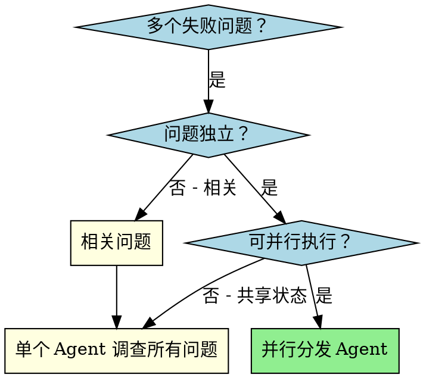
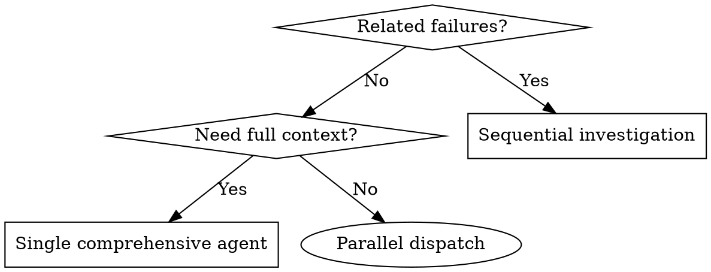

# Multi-Agent 任务编排指南

## 目录

- [概述](#概述)
- [何时使用](#何时使用)
- [核心原则](#核心原则)
- [实施步骤](#实施步骤)
- [Agent Prompt 结构](#agent-prompt-结构)
- [决策流程图](#决策流程图)
- [实战示例](#实战示例)
- [常见错误](#常见错误)
- [何时不用](#何时不用)
- [验证与整合](#验证与整合)

---

## 概述

Multi-Agent 任务编排是一种将复杂问题分解为多个独立子问题，并行分发给专门 Agent 处理的协作模式。通过精确构建每个 Agent 的指令和上下文，确保它们专注于各自的任务并成功完成工作。

**核心价值：**
- **并行化** - 多个调查同时进行
- **专注性** - 每个 Agent 范围窄，需要追踪的上下文少
- **独立性** - Agent 之间互不干扰
- **高效性** - N 个问题用 1 个问题的时间解决

---

## 何时使用

### 适用场景

- **多个独立失败** - 3+ 个测试文件失败，且根因不同
- **多子系统故障** - 多个子系统独立损坏
- **独立问题域** - 每个问题可以独立理解，无需其他问题上下文
- **无共享状态** - 各调查之间无状态共享

### 典型场景举例

| 场景 | 问题域划分 |
|------|-----------|
| 测试文件失败 | File A → 工具审批流 / File B → 批处理行为 / File C → 中止功能 |
| 子系统故障 | 认证模块 / 支付模块 / 通知模块 |
| Bug 调查 | A 模块内存泄漏 / B 模块超时 / C 模块空指针 |

---

## 核心原则

> **一个 Agent 只做一件事，所有 Agent 同时做，最后合并。**

### 三步走策略

```
┌─────────────────────────────────────────────────────────┐
│  1. 识别独立域 (Identify Independent Domains)             │
│     - 将失败按问题类型分组                               │
│     - 每个域应该与其他域完全独立                         │
└─────────────────────────────────────────────────────────┘
                          ↓
┌─────────────────────────────────────────────────────────┐
│  2. 并行分发 (Dispatch in Parallel)                     │
│     - 每个域分配一个专门的 Agent                         │
│     - 所有 Agent 同时开始工作                            │
└─────────────────────────────────────────────────────────┘
                          ↓
┌─────────────────────────────────────────────────────────┐
│  3. 汇总整合 (Review and Integrate)                     │
│     - 读取每个 Agent 的摘要                              │
│     - 验证修复不冲突                                     │
│     - 运行完整测试套件                                   │
└─────────────────────────────────────────────────────────┘
```

---

## 实施步骤

### 步骤 1：识别独立问题域

将失败按问题类型分组：

```
失败样例：
- agent-tool-abort.test.ts: 3 个失败（时序问题）
- batch-completion-behavior.test.ts: 2 个失败（工具未执行）
- tool-approval-race-conditions.test.ts: 1 个失败（执行计数 = 0）

分组结果：
┌─────────────────┐    ┌─────────────────────────┐    ┌─────────────────────────┐
│ Domain A        │    │ Domain B                │    │ Domain C                │
│ agent-tool-abort│    │ batch-completion-behavior│    │ tool-approval-race       │
└─────────────────┘    └─────────────────────────┘    └─────────────────────────┘
```

### 步骤 2：创建专注的 Agent 任务

每个 Agent 接收：

| 组成部分 | 说明 |
|---------|------|
| **具体范围** | 一个测试文件或子系统 |
| **清晰目标** | 让这些测试通过 |
| **约束条件** | 不要改变其他代码 |
| **预期输出** | 返回发现和修复的摘要 |

### 步骤 3：并行分发

在 Claude Code / AI 环境中：

```typescript
// 三个 Agent 同时运行
Task("Fix agent-tool-abort.test.ts failures")
Task("Fix batch-completion-behavior.test.ts failures")
Task("Fix tool-approval-race-conditions.test.ts failures")
```

### 步骤 4：审查和整合

Agent 返回后：
1. 阅读每个摘要
2. 验证修复不冲突
3. 运行完整测试套件
4. 抽查关键修复

---

## Agent Prompt 结构

### 良好的 Prompt 要素

```
1. 聚焦 (Focused)      - 一个清晰的问题域
2. 自包含 (Self-contained) - 提供理解问题所需的全部上下文
3. 输出明确 (Specific output) - Agent 应该返回什么
```

### Prompt 模板

```markdown
## Role
你是一个专业的调试专家。

## Task
修复 src/xxx/test-file.test.ts 中的 N 个失败测试：

1. "测试名称 1" - 具体期望 vs 实际行为
2. "测试名称 2" - 具体期望 vs 实际行为
3. "测试名称 N" - 具体期望 vs 实际行为

## Context
这是 [模块名] 模块的问题，错误发生在 [具体位置]。

## Your Task
1. 阅读测试文件，理解每个测试验证的内容
2. 识别根本原因 - 是时序问题还是实际 bug？
3. 修复方式：
   - 用事件等待替代任意 timeout
   - 修复实现中的 bug（如发现）
   - 如测试验证的是变化的行为，调整测试期望

## Constraints
- **不要** 只增加 timeout 来掩盖问题 - 找到真正的问题
- **只修改** 指定的问题域，不要动其他代码

## Return Format
返回以下格式的摘要：
```
## 根本原因
[描述]

## 修复内容
- [修复 1]
- [修复 2]

## 修改的文件
- [文件路径]: [行号] - [修改内容]
```
```

### 实际 Prompt 示例

```markdown
## Role
调试专家，专注于认证模块。

## Task
修复 src/agents/auth.test.ts 中的 2 个失败测试：

1. "should timeout after 30s" - 期望响应包含 'timeout' 字符串，实际返回 null
2. "should retry on 401" - 期望重试 3 次，实际只重试 1 次

错误堆栈：
- Test 1: Error: expected 'timeout' to be in response
- Test 2: Error: expected 3 retries, got 1

## Context
认证模块最近重构了重试逻辑，timeout 处理也有变化。
测试环境：Node.js 18+, Jest 29+

## Your Task
1. 读 auth.test.ts，理解每个测试验证什么
2. 读 auth.go 的实现，找到根本原因
3. 修复认证模块的 bug

## Constraints
- 只修改 src/auth/ 下的代码
- 不要改变测试文件

## Return
返回根本原因、修复内容和修改的文件列表。
```

---

## 决策流程图



### 决策判断

| 问题 | 判断 | 结果 |
|-----|------|-----|
| 问题独立？ | 否 | 单个 Agent 调查所有问题 |
| 问题独立？ | 是，但共享状态 | 串行 Agent |
| 问题独立？ | 是，无共享状态 | **并行分发 Agent** |

---

## 实战示例

### 场景：6 个测试失败，跨 3 个文件

#### 失败分布

| 文件 | 失败数 | 问题类型 |
|------|--------|----------|
| agent-tool-abort.test.ts | 3 | 时序问题 |
| batch-completion-behavior.test.ts | 2 | 工具未执行 |
| tool-approval-race-conditions.test.ts | 1 | 执行计数 = 0 |

#### 分发决策

**分析：**
- 三类失败互不相关
- 修复工具审批不会影响中止逻辑
- Agent 之间无共享状态

**结论：可并行分发**

#### Agent 分工

```
┌──────────────────────────────────────────────────────────────────┐
│ Agent 1: Fix agent-tool-abort.test.ts                            │
│ 职责: 修复 3 个时序相关失败                                        │
│ 方法: 用事件等待替代 arbitrary timeout                            │
├──────────────────────────────────────────────────────────────────┤
│ Agent 2: Fix batch-completion-behavior.test.ts                   │
│ 职责: 修复 2 个工具执行失败                                        │
│ 方法: 修复事件结构 bug（threadId 位置错误）                       │
├──────────────────────────────────────────────────────────────────┤
│ Agent 3: Fix tool-approval-race-conditions.test.ts               │
│ 职责: 修复 1 个执行计数为 0 的失败                                 │
│ 方法: 添加 async 工具执行完成的等待                               │
└──────────────────────────────────────────────────────────────────┘
                           ↓
                    并行执行，同时运行
                           ↓
┌──────────────────────────────────────────────────────────────────┐
│ 整合结果                                                          │
│ - 所有修复独立，无冲突                                            │
│ - 完整测试套件通过                                               │
│ - 时间节省：3 个问题并行解决 vs 串行调查                          │
└──────────────────────────────────────────────────────────────────┘
```

---

## 常见错误

### ❌ 范围太宽

```markdown
# 错误示例
"修复所有失败的测试"
→ Agent 迷失方向，不知道从何入手

# 正确示例
"修复 agent-tool-abort.test.ts"
→ 聚焦的明确范围
```

### ❌ 缺乏上下文

```markdown
# 错误示例
"修复竞态条件"
→ Agent 不知道在哪里找

# 正确示例
"修复 auth/test/race_condition.test.ts 中的竞态条件：
  - Line 45: expect(count).toBe(3) 实际为 0
  - Line 67: timeout 发生在错误时机"
→ 提供具体位置和错误信息
```

### ❌ 无约束条件

```markdown
# 错误示例
"修复这个 bug"
→ Agent 可能会重构整个系统

# 正确示例
"修复这个 bug：
  Constraints:
  - 只修改 src/auth/login.go
  - 不要改变测试文件
  - 不要修改其他模块"
→ 明确的边界
```

### ❌ 输出模糊

```markdown
# 错误示例
"修好了"
→ 不知道改了什么

# 正确示例
"返回：
## 根本原因
race condition 发生在第 45 行，状态未正确锁定

## 修复
- 添加 mutex 保护临界区
- 重构第 45-60 行的状态管理

## 文件变更
- src/auth/login.go:45 - 添加 mutex.Lock()
- src/auth/login.go:52 - 添加 defer mutex.Unlock()"
→ 清晰的变更清单
```

---

## 何时不用

### 不适用场景

| 场景 | 原因 | 推荐方案 |
|------|------|----------|
| **失败相互关联** | 修一个可能修全部 | 先一起调查 |
| **需要完整上下文** | 理解需要看到整个系统 | 单个 Agent 全面调查 |
| **探索性调试** | 还不清楚哪里坏了 | 先探索再决定 |
| **共享状态** | Agent 会互相干扰（编辑同一文件、使用同一资源） | 串行执行 |

### 替代方案



---

## 验证与整合

### 整合检查清单

- [ ] 阅读每个 Agent 返回的摘要
- [ ] 理解每个修复的变更内容
- [ ] 检查是否有冲突（多个 Agent 修改了同一文件）
- [ ] 运行完整测试套件验证所有修复
- [ ] 抽查关键修复确保没有系统性错误

### 冲突处理

如果发现冲突：

```
Scenario: Agent A 和 Agent B 都修改了 auth.go

处理步骤：
1. 读取两个版本的修改
2. 评估修改是否真正冲突
3. 如可合并，手动合并
4. 如不可合并，保留更合理的版本并重新验证
```

### 最终验证

```bash
# 运行完整测试套件
npm test

# 如有 CI，运行完整 CI 流程
npm run ci
```

---

## 总结

| 关键点 | 说明 |
|-------|------|
| **识别独立域** | 将问题按独立领域分组 |
| **精确分发** | 每个 Agent 一个具体任务 |
| **清晰约束** | 明确不要改变什么 |
| **明确输出** | 定义 Agent 应返回的格式 |
| **并行执行** | 独立问题同时处理 |
| **验证整合** | 检查冲突，运行全套测试 |

**记住：** 多 Agent 编排的核心是「分而治之」—— 将复杂问题分解为可并行处理的独立子问题。
