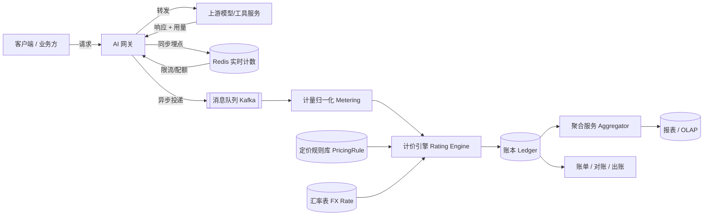
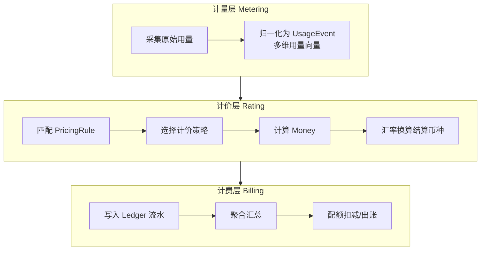
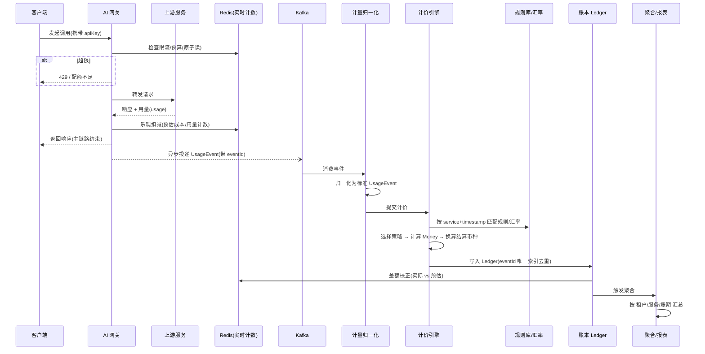
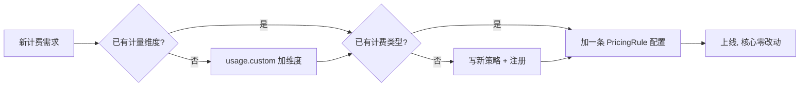

# AI 网关统一计量与计费系统设计

## 目录

- [概述](#概述)
- [要解决的核心问题](#要解决的核心问题)
- [设计原则](#设计原则)
- [整体架构](#整体架构)
- [分层模型：计量 / 计价 / 计费](#分层模型计量--计价--计费)
- [核心数据结构设计](#核心数据结构设计)
  - [1. UsageEvent（统一计量事件）](#1-usageevent统一计量事件)
  - [2. PricingRule（定价规则）](#2-pricingrule定价规则)
  - [3. RatedRecord（计价流水）](#3-ratedrecord计价流水)
  - [4. Ledger（账本条目）](#4-ledger账本条目)
  - [5. QuotaCounter（实时配额计数）](#5-quotacounter实时配额计数)
  - [6. 汇率与币种](#6-汇率与币种)
- [数据流转](#数据流转)
  - [端到端时序](#端到端时序)
  - [同步埋点 + 异步计费](#同步埋点--异步计费)
  - [幂等与去重](#幂等与去重)
  - [聚合与报表链路](#聚合与报表链路)
- [计费引擎：可插拔策略设计](#计费引擎可插拔策略设计)
- [如何扩展新的计费规则](#如何扩展新的计费规则)
- [数据存储选型](#数据存储选型)
- [一致性、精度与对账](#一致性精度与对账)
- [容错与降级](#容错与降级)
- [落地清单](#落地清单)
- [常见误区](#常见误区)

---

## 概述

AI 网关（AI Gateway）作为所有上游模型与工具服务的统一入口，天然承担**计量（Metering）**与**计费（Billing）**职责。难点在于上游服务的计费口径高度异构：

- **按 token 计费**：如 GPT、Claude，区分 input/output token 单价；
- **按时长计费**：如语音识别（Whisper）、TTS、视频处理，按秒/毫秒；
- **按次计费**：如图像生成、Rerank，按请求次数；
- **直接给美元金额**：某些三方服务回包直接返回 `cost`；
- **未来规则未知**：阶梯计费、包月、混合计费、GPU 秒等。

本文给出一套**采集与计费彻底解耦**的设计：用统一的多维计量模型吸收采集端差异，用可插拔的计价策略吸收计费端差异，最终收敛到统一的账本（Ledger）与结算币种，达成"统一计费标准"。

> 一句话概括：**计量只记录"用了多少"，计价负责把"用了多少"换算成"多少钱"，计费负责把"多少钱"记账并统计。三层解耦，各自演进。**

---

## 要解决的核心问题

| 问题             | 描述                           | 本设计的解法                      |
| ---------------- | ------------------------------ | --------------------------------- |
| **计量口径异构** | token / 秒 / 次 / 美元并存     | 统一 UsageEvent 多维用量向量      |
| **计费规则易变** | 单价会调整、会促销、会加新维度 | 规则配置化 + 版本化 + 生效时间    |
| **新增计费方式** | 未来出现全新计费模型           | 策略模式 + 策略注册表，核心零改动 |
| **统一结算**     | 多币种、多单位难以汇总         | 统一 Money + 汇率快照 + 统一账本  |
| **性能影响**     | 计费不能拖慢网关主链路         | 同步轻量埋点 + 异步计费           |
| **准确性**       | 重复消费、丢失、精度误差       | 幂等去重 + Decimal 精度 + 可重算  |
| **实时性**       | 限流/配额需实时用量            | Redis 计数器旁路 + 最终账本对账   |

---

## 设计原则

1. **计量与计费解耦**：采集层只忠实记录用量，不含任何价格逻辑。改价格、加计费方式，采集层零改动。
2. **数据驱动 + 策略可插拔**：定价规则是数据（存 DB），计费类型是策略（可注册）。新增规则优先"加配置"，其次"加策略"。
3. **统一收敛**：无论哪种计费类型，最终都输出统一的 `Money{amount, currency}`，落到统一账本。
4. **可重算（Replayable）**：保留原始 UsageEvent 与规则版本，任何账单都能按当时规则重新计算，用于对账与纠纷。
5. **精度优先**：金额一律用高精度 Decimal，禁止 float。
6. **开闭原则**：对扩展开放，对修改关闭——核心的采集/账本/统计链路稳定不动。

---

## 整体架构



- **主链路（在线）**：网关转发 + 同步埋点（写 Redis 计数用于限流/配额），毫秒级，不阻塞。
- **计费链路（旁路，异步）**：Kafka → 计量归一化 → 计价 → 账本，秒级最终一致。
- **统计链路（离线/近实时）**：账本 → 聚合 → 报表 / 出账。

---

## 分层模型：计量 / 计价 / 计费



| 层                | 输入                         | 输出                      | 职责                     |
| ----------------- | ---------------------------- | ------------------------- | ------------------------ |
| **计量 Metering** | 各服务异构用量               | `UsageEvent`              | 记录"用了多少"，统一结构 |
| **计价 Rating**   | `UsageEvent` + `PricingRule` | `RatedRecord`（含 Money） | 把用量换算成"多少钱"     |
| **计费 Billing**  | `RatedRecord`                | `Ledger` + 聚合           | 记账、汇总、扣配额、出账 |

---

## 核心数据结构设计

### 1. UsageEvent（统一计量事件）

计量层的核心抽象。**usage 是一个可扩展的多维度字典**，token、秒、次数、图片、GPU 秒都是并列维度——新增计量维度只加字段，不改结构。

```typescript
interface UsageEvent {
  eventId: string // 全局唯一，幂等键（建议 UUID / 雪花ID）
  traceId: string // 关联请求链路，串联可观测性
  timestamp: string // ISO8601，事件发生时间（计价按此时点选规则/汇率）

  // 归属维度（多租户 & 计费主体）
  tenantId: string // 组织/租户
  userId?: string // 用户
  apiKeyId: string // 调用凭证
  projectId?: string // 项目/应用

  // 服务标识（决定用哪条定价规则）
  service: string // 如 "openai.gpt-4o"
  operation?: string // 如 "chat.completions"
  modelVersion?: string
  region?: string

  // 多维用量向量（核心可扩展点）
  usage: {
    requests?: number // 调用次数
    inputTokens?: number // 输入 token
    outputTokens?: number // 输出 token
    cachedTokens?: number // 命中缓存的 token（通常低价/免费）
    durationMs?: number // 时长（秒计费类）
    images?: number // 图片数
    characters?: number // 字符数（部分 TTS）
    // 直连服务已返回金额时透传，供 passthrough 策略使用
    vendorCost?: { amount: string; currency: string }
    // 兜底扩展：任意自定义计量维度，无需改 schema
    custom?: Record<string, number> // 如 { gpuSeconds: 2.1 }
  }

  status: 'success' | 'error' | 'partial' // 失败是否计费由规则决定
  createdAt: string // 落库时间
}
```

设计要点：

- **eventId 是幂等基石**，贯穿计价、账本，保证"至少一次投递"下不重复扣费。
- **usage 用可选字段 + custom 兜底**：新增维度（如 `gpuSeconds`）直接进 `custom`，采集层与传输结构完全不动。
- **vendorCost 透传**：解决"上游直接返回美元"的情况，由 `passthrough` 策略原样采纳。
- **timestamp 决定规则/汇率版本**：保证历史事件用历史价格重算。

### 2. PricingRule（定价规则）

定价规则**配置化存 DB，绝不硬编码**。用 `billingType` 决定用哪种策略，用 `components` 描述每个计量维度的单价，用 `effectiveFrom/To` 做版本化。

```typescript
interface PricingRule {
  ruleId: string
  service: string // 匹配 UsageEvent.service
  operation?: string // 更细粒度匹配（可选）
  billingType: BillingType // 决定计价策略
  currency: string // 规则定价币种，如 "USD"

  // 计价组件：每个计量维度一条
  components: PricingComponent[]

  // 阶梯/分层（tiered 类型使用）
  tiers?: PricingTier[]

  minCharge?: string // 最低消费（Decimal 字符串）
  chargeOnError?: boolean // 失败是否计费，默认 false

  // 版本化：保证历史可重算
  effectiveFrom: string // 生效起
  effectiveTo?: string | null // 生效止（null=当前有效）
  priority?: number // 多规则命中时的优先级
  version: number
}

type BillingType =
  | 'token' // 按 token
  | 'duration' // 按时长
  | 'fixed' // 按次
  | 'tiered' // 阶梯
  | 'passthrough' // 直接采纳上游金额
  | 'composite' // 组合（多种叠加）

interface PricingComponent {
  metric: string // 对应 usage 中的维度键，如 "inputTokens" / "custom.gpuSeconds"
  unitPrice: string // 单价，Decimal 字符串
  per: number // 计价单位量，如 per=1000 表示每千 token
  freeQuota?: number // 免费额度（先扣免费部分）
}

interface PricingTier {
  metric: string
  upTo: number | null // 该档上限，null 表示无上限
  unitPrice: string
  per: number
}
```

示例——GPT-4o（按 token）：

```json
{
  "ruleId": "gpt-4o-standard",
  "service": "openai.gpt-4o",
  "billingType": "token",
  "currency": "USD",
  "components": [
    { "metric": "inputTokens", "unitPrice": "0.0000025", "per": 1 },
    { "metric": "outputTokens", "unitPrice": "0.00001", "per": 1 },
    { "metric": "cachedTokens", "unitPrice": "0.00000125", "per": 1 }
  ],
  "chargeOnError": false,
  "effectiveFrom": "2026-01-01T00:00:00Z",
  "version": 3
}
```

示例——Whisper（按秒）：

```json
{
  "ruleId": "whisper-audio",
  "service": "openai.whisper",
  "billingType": "duration",
  "currency": "USD",
  "components": [
    { "metric": "durationMs", "unitPrice": "0.0001", "per": 1000 }
  ],
  "effectiveFrom": "2026-01-01T00:00:00Z",
  "version": 1
}
```

示例——直连服务透传美元：

```json
{
  "ruleId": "vendor-x-passthrough",
  "service": "vendorx.api",
  "billingType": "passthrough",
  "currency": "USD",
  "components": [],
  "effectiveFrom": "2026-01-01T00:00:00Z",
  "version": 1
}
```

### 3. RatedRecord（计价流水）

计价引擎的输出。保留计算明细（用了哪条规则、每个维度算了多少），保证**可审计、可重算**。

```typescript
interface RatedRecord {
  ratedId: string
  eventId: string // 关联 UsageEvent（幂等）
  ruleId: string
  ruleVersion: number // 记录当时规则版本

  // 计价明细：每个维度的用量、单价、小计
  breakdown: Array<{
    metric: string
    quantity: number
    unitPrice: string
    amount: string // 该维度小计（Decimal）
  }>

  originalCost: { amount: string; currency: string } // 规则原币种金额
  fxRate: string // 换算汇率（快照）
  settledCost: { amount: string; currency: string } // 结算币种金额（如 USD）

  ratedAt: string
}
```

### 4. Ledger（账本条目）

统一账本是**统计与出账的唯一事实来源**。只认结算币种金额，屏蔽所有上游差异。

```typescript
interface LedgerEntry {
  ledgerId: string
  ratedId: string
  eventId: string // 幂等键（唯一索引，防重复入账）

  tenantId: string
  apiKeyId: string
  service: string

  amount: string // 结算币种金额（Decimal）
  currency: string // 统一结算币种
  direction: 'debit' | 'credit' // 借/贷（充值为 credit，消费为 debit）

  billingPeriod: string // 账期，如 "2026-07"
  occurredAt: string // 业务发生时间
  postedAt: string // 入账时间
}
```

### 5. QuotaCounter（实时配额计数）

用于限流与配额，走 Redis，追求**低延迟而非强一致**（最终以账本对账为准）。

```typescript
// Redis 结构示例
// 用量计数（滑动/固定窗口）
"usage:{tenantId}:{service}:{yyyyMMdd}" -> INCRBY tokens
// 预算余额（原子扣减）
"budget:{tenantId}:{yyyyMM}"            -> DECRBY estimatedCost
// 速率限流（令牌桶 / 固定窗口）
"ratelimit:{apiKeyId}:{minute}"         -> INCR requests
```

> 在线链路用"预估成本"做乐观扣减以实现实时预算控制，异步账本落地后做**差额校正（reconciliation）**，保证长期准确。

### 6. 汇率与币种

```typescript
interface FxRate {
  base: string // 源币种，如 "CNY"
  quote: string // 目标结算币种，如 "USD"
  rate: string // 汇率（Decimal）
  effectiveFrom: string
  effectiveTo?: string | null
}
```

计价时按 `UsageEvent.timestamp` 取当时汇率快照并写入 `RatedRecord.fxRate`，保证历史金额可复算、不被汇率波动污染。

---

## 数据流转

### 端到端时序



### 同步埋点 + 异步计费

**为什么拆两条链路**：计费涉及规则匹配、汇率换算、DB 写入，若放在主链路会增加请求延迟并引入故障点。因此：

- **主链路（同步）**：只做两件轻量事——限流/预算检查（读 Redis）、乐观计数（写 Redis）。即使计费系统整体宕机，网关转发不受影响。
- **计费链路（异步）**：网关把 `UsageEvent` 打到 Kafka 后即返回。计量、计价、入账全部旁路完成，秒级最终一致。

### 幂等与去重

"至少一次投递"是消息队列常态，必须防重复扣费：

1. `UsageEvent.eventId` 全局唯一，在网关生成。
2. `LedgerEntry` 对 `eventId` 建**唯一索引**，重复入账直接冲突丢弃。
3. 计价为**纯函数**：相同 `eventId + ruleVersion` 必然算出相同结果，重算安全。

### 聚合与报表链路

- **预聚合**：账本按 `tenant × service × 小时/天` 预聚合成汇总表，报表查询走汇总表而非明细，降低 OLAP 压力。
- **多维分析**：明细进列存/OLAP（ClickHouse / Doris / BigQuery），支持任意维度下钻。
- **实时看板**：Redis 计数器提供近实时用量，账本提供准确金额，两者互补。

---

## 计费引擎：可插拔策略设计

用**策略模式 + 注册表**，让"加新计费类型 = 注册一个策略"，核心 rating 流程零改动。所有策略输出统一的 `Money`。

```typescript
interface Money {
  amount: string
  currency: string
} // 用 Decimal 字符串

interface PricingStrategy {
  calculate(
    event: UsageEvent,
    rule: PricingRule
  ): {
    money: Money
    breakdown: RatedRecord['breakdown']
  }
}

// 按 token / 时长 / 字符等"按量线性"计费（token、duration、fixed 可共用）
class MeteredPricing implements PricingStrategy {
  calculate(event, rule) {
    const breakdown = rule.components.map(c => {
      const raw = getMetric(event.usage, c.metric) ?? 0 // 支持 "custom.gpuSeconds"
      const billable = Math.max(0, raw - (c.freeQuota ?? 0)) // 先扣免费额度
      const amount = Decimal.mul(billable / c.per, c.unitPrice)
      return {
        metric: c.metric,
        quantity: billable,
        unitPrice: c.unitPrice,
        amount
      }
    })
    return {
      money: { amount: sumAmounts(breakdown), currency: rule.currency },
      breakdown
    }
  }
}

// 阶梯计费
class TieredPricing implements PricingStrategy {
  /* 遍历 tiers 分档累加 */
}

// 直接采纳上游返回的金额
class PassthroughPricing implements PricingStrategy {
  calculate(event, rule) {
    const c = event.usage.vendorCost!
    return {
      money: { amount: c.amount, currency: c.currency },
      breakdown: [
        {
          metric: 'vendorCost',
          quantity: 1,
          unitPrice: c.amount,
          amount: c.amount
        }
      ]
    }
  }
}

// 组合计费：内部委托多个子策略叠加
class CompositePricing implements PricingStrategy {
  /* 组合 components 分别用不同策略 */
}

// 策略注册表：新增计费类型只需在此注册
const STRATEGY_REGISTRY: Record<BillingType, PricingStrategy> = {
  token: new MeteredPricing(),
  duration: new MeteredPricing(),
  fixed: new MeteredPricing(),
  tiered: new TieredPricing(),
  passthrough: new PassthroughPricing(),
  composite: new CompositePricing()
}

// 计价主流程：稳定不变
function rate(event: UsageEvent): RatedRecord {
  const rule = matchRule(event.service, event.operation, event.timestamp) // 按时点选版本
  if (event.status === 'error' && !rule.chargeOnError)
    return zeroRated(event, rule)

  const strategy = STRATEGY_REGISTRY[rule.billingType]
  const { money, breakdown } = strategy.calculate(event, rule)
  const withMin = applyMinCharge(money, rule.minCharge)

  const fx = getFxRate(withMin.currency, SETTLEMENT_CURRENCY, event.timestamp)
  const settled = convert(withMin, fx, SETTLEMENT_CURRENCY)

  return buildRatedRecord(event, rule, breakdown, withMin, fx, settled)
}
```

这正是"统一计费标准"的落点：**异构规则 → 统一 `Money` → 统一结算币种 → 统一账本**。

---

## 如何扩展新的计费规则

以后新增一个「按 GPU 秒 + 阶梯折扣」的服务，按成本从低到高分三档：

| 场景                            | 需要做的事                                                                 | 是否改核心代码 |
| ------------------------------- | -------------------------------------------------------------------------- | -------------- |
| **已有维度、已有类型**          | 只加一条 `PricingRule` 配置                                                | 否             |
| **新计量维度**（如 gpuSeconds） | 采集端写入 `usage.custom.gpuSeconds`，规则里 `metric: "custom.gpuSeconds"` | 否（结构不变） |
| **已有类型可复用**（如 tiered） | 加一条 `billingType: "tiered"` 的规则                                      | 否             |
| **全新计费逻辑**                | 写一个新 `PricingStrategy` 注册进 registry                                 | 仅新增一个类   |

**采集、账本、统计、报表链路一行都不用改**——这是解耦设计的直接收益。



---

## 数据存储选型

| 数据                     | 存储                     | 理由                                    |
| ------------------------ | ------------------------ | --------------------------------------- |
| `UsageEvent` 原始明细    | 消息队列 + 对象存储/列存 | 高吞吐写入、可回溯重算                  |
| `PricingRule` / `FxRate` | 关系库（Postgres/MySQL） | 强一致、版本化、事务                    |
| `RatedRecord` / `Ledger` | 关系库 + 列存归档        | 账本需强一致 + 唯一索引；历史归档做分析 |
| `QuotaCounter`           | Redis                    | 低延迟原子计数、限流                    |
| 聚合/报表                | OLAP（ClickHouse/Doris） | 大规模多维聚合                          |

---

## 一致性、精度与对账

- **精度**：所有金额用 Decimal（DB 用 `DECIMAL(38,18)`），传输用字符串，禁止 float，避免累积误差。
- **实时 vs 准确**：Redis 计数用于实时限流（可容忍少量误差），账本为最终事实；异步入账后做**差额校正**。
- **可重算对账**：定期用原始 `UsageEvent` + 历史 `PricingRule` 重算账单，与账本比对，发现漏计/重计。
- **规则版本化**：`effectiveFrom/To + version` 保证改价不影响历史账单，历史事件永远用当时规则。

---

## 容错与降级

| 故障           | 影响                       | 降级策略                                          |
| -------------- | -------------------------- | ------------------------------------------------- |
| 计费系统宕机   | 不影响网关转发（异步旁路） | 事件积压在 Kafka，恢复后补算                      |
| Redis 不可用   | 实时限流失效               | 降级为放行 + 事后账本约束，或本地令牌桶兜底       |
| 规则库不可用   | 无法计价                   | 事件滞留队列，规则库恢复后重放                    |
| 汇率缺失       | 无法换算                   | 用最近一次汇率快照 + 标记待校正                   |
| 上游未返回用量 | 无法计量                   | 用请求侧估算（如 tokenizer 预估）+ 标记 estimated |

---

## 落地清单

1. 在网关注入 `eventId/traceId`，统一采集 `UsageEvent`。
2. 定义 `usage` 多维模型，约定 `custom` 兜底扩展规范。
3. 建立 `PricingRule` 配置库，规则版本化 + 生效时间。
4. 实现策略注册表：token/duration/fixed/tiered/passthrough/composite。
5. 主链路只做 Redis 限流 + 乐观扣减，计费全部异步。
6. 账本对 `eventId` 建唯一索引，保证幂等。
7. 引入汇率快照，统一结算币种。
8. 搭建预聚合 + OLAP 报表，Redis 提供近实时看板。
9. 定期重算对账，监控漏计/重计/延迟。

---

## 常见误区

- **一开始就把所有东西换算成美元存**：丢失原始用量与币种，无法重算、无法审计。应先存多维用量，计价时再收敛。
- **把计费逻辑写死在网关代码里**：改个单价就要发版。应配置化 + 策略化。
- **计费放在请求主链路同步做**：拖慢响应、引入故障点。应异步旁路。
- **用 float 存金额**：累积误差导致对账对不平。必须 Decimal。
- **只有实时计数没有账本**：Redis 数据易失、无法审计出账。实时计数是辅助，账本才是事实来源。
- **规则不做版本化**：调价后历史账单被污染，无法解释。必须 `effectiveFrom/To + version`。
