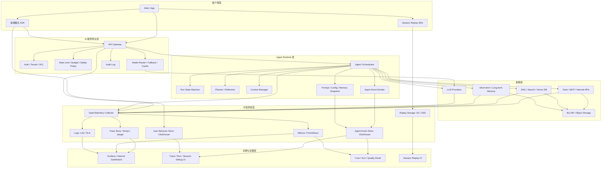
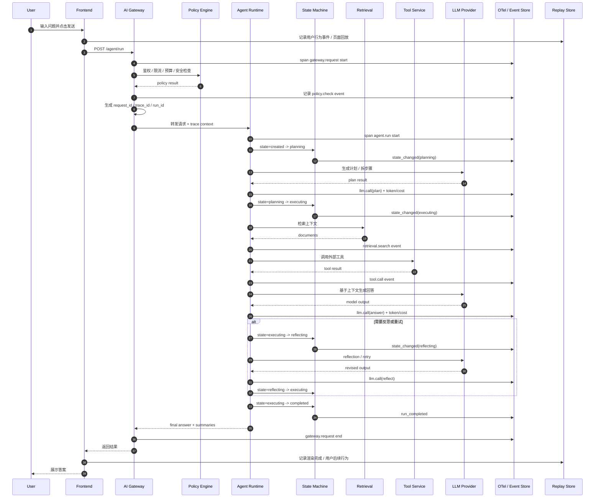

# AI 服务网关治理、日志追踪、Agent 状态轨迹与用户行为复现

## 一句话总结

AI 系统的可观测性，不是简单地多打一层 API 日志，而是要把一次用户请求沉淀成一条可关联、可查询、可回放、可重放的执行链路，能够同时回答下面四类问题：

- 谁在用，是否被正确治理，成本是否可控。
- 模型这次为什么返回了这个结果，耗时和代价在哪里。
- Agent 在运行过程中做了哪些决策，状态如何迁移，卡在了哪一步。
- 用户当时是怎么操作的，系统是否能在接近原始上下文的条件下复现问题。

如果要压缩成一句工程表达：

`AI observability = Gateway governance + LLM trace + Agent runtime event stream + User journey replay`

---

## 目录

- [一、为什么 AI 系统的可观测性和传统微服务不同](#一为什么-ai-系统的可观测性和传统微服务不同)
- [二、AI 可观测性的核心目标](#二ai-可观测性的核心目标)
- [三、四层观测链模型](#三四层观测链模型)
- [四、统一 ID 设计](#四统一-id-设计)
- [五、AI 服务网关治理](#五ai-服务网关治理)
- [六、日志、指标、链路追踪如何分工](#六日志指标链路追踪如何分工)
- [七、Agent 运行时状态轨迹设计](#七agent-运行时状态轨迹设计)
- [八、用户行为轨迹与执行复现](#八用户行为轨迹与执行复现)
- [九、Snapshot、Replay 与审计策略](#九snapshotreplay-与审计策略)
- [十、完整总体架构图](#十完整总体架构图)
- [十一、OpenTelemetry 埋点规范](#十一opentelemetry-埋点规范)
- [十二、事件模型设计](#十二事件模型设计)
- [十三、ClickHouse 建表 SQL 示例](#十三clickhouse-建表-sql-示例)
- [十四、AI 网关与 Agent Runtime 时序图](#十四ai-网关与-agent-runtime-时序图)
- [十五、Dashboard 设计与排障路径](#十五dashboard-设计与排障路径)
- [十六、分三期建设路线图](#十六分三期建设路线图)
- [十七、常见坑与治理原则](#十七常见坑与治理原则)
- [十八、面试回答版总结](#十八面试回答版总结)

---

## 一、为什么 AI 系统的可观测性和传统微服务不同

传统微服务的核心观测对象通常是：

- 请求有没有进来
- 调了哪些下游服务
- 延迟和错误率如何
- 数据库或缓存有没有异常

但 AI 系统在此基础上多了三层复杂度：

### 1. 输出是不确定的

同样的输入，在不同模型版本、不同温度、不同上下文、不同工具返回值下，可能得到不同结果。  
因此 AI 系统不仅要观测“有没有成功”，还要观测“为什么这样成功”或“为什么这样失败”。

### 2. 输入不再只是参数，而是上下文装配结果

传统接口主要关心请求参数；AI 系统更关心模型到底看到了哪些内容。  
影响结果的往往不是 API 参数本身，而是：

- system prompt 版本
- prompt template 版本
- 注入了哪些历史消息
- 检索到了哪些文档
- memory 中加载了哪些状态
- 工具返回了哪些内容

所以 AI 可观测性天然需要 `context observability`。

### 3. Agent 有状态迁移和多步执行过程

一个 agent run 往往不是单次模型调用，而是一连串步骤：

1. 接收目标
2. 制定计划
3. 检索上下文
4. 调用工具
5. 再次调用模型
6. 反思、重试或终止

如果只看一条 API 日志，只能看到“开始”和“结束”，看不到中间状态机和决策链路。

### 4. 用户问题往往要靠“回放”才能定位

很多线上问题不是简单的接口报错，而是：

- 用户点了停止生成
- 用户切换了模型
- 用户追问时带上了不完整上下文
- 前端把同一条消息发了两次
- 用户上传文件后又撤销

因此只保留服务端日志不够，还需要 `user journey replay`。

---

## 二、AI 可观测性的核心目标

一个成熟的 AI 可观测性体系，至少要满足以下目标：

### 1. 治理

能回答：

- 谁在调用系统
- 调用了哪个模型和哪个版本
- 是否命中了限流、预算、合规、安全策略
- 是否发生降级、fallback、缓存命中

### 2. 诊断

能回答：

- 慢在哪里
- 错在哪里
- 是模型问题、上下文问题、工具问题，还是编排问题
- 哪一步导致最终输出偏离预期

### 3. 复现

能回答：

- 用户当时如何操作
- 系统当时用了什么配置
- 是否可以基于相同快照重新运行

### 4. 优化

能回答：

- 哪类问题最消耗 token
- 哪个工具最容易失败
- 哪个阶段最耗时
- 哪种 prompt 或模型版本效果更好

### 5. 审计

能回答：

- 是否泄露过敏感信息
- 某条结果是谁触发的
- 哪个版本的系统在某个时间点产生了某个响应

---

## 三、四层观测链模型

建议把整个 AI 系统的可观测性拆成四条链路，不要把所有问题都塞进同一类日志里。

## 1. 网关治理链

解决“入口治理”问题：

- 鉴权
- 租户隔离
- 限流
- 预算
- 内容安全
- 模型路由
- 降级与 fallback
- 审计

它关心的是：

- 谁来调
- 能不能调
- 应该调哪个模型
- 这次调用值不值得

## 2. 推理调用链

解决“单次推理”问题：

- prompt 模板是什么
- 模型是什么
- token 用了多少
- 花了多少钱
- 耗时多少
- finish reason 是什么

它关心的是：

- 这一次模型调用发生了什么

## 3. Agent 运行链

解决“多步执行”问题：

- 计划怎么拆
- 每一步做了什么
- 状态怎么变
- 调了哪些工具
- 哪一步失败
- 是否发生重试或反思

它关心的是：

- 这次 run 是怎么跑完或跑坏的

## 4. 用户行为链

解决“用户操作轨迹”问题：

- 用户什么时候进入页面
- 输入了什么
- 何时点击发送
- 何时停止生成
- 是否追问
- 是否切换模型
- 是否上传文件

它关心的是：

- 用户到底经历了什么

这四条链最终必须靠统一 ID 串起来，否则系统里会存在四套互相断裂的数据。

---

## 四、统一 ID 设计

统一 ID 是整套方案的基础。没有统一 ID，所有日志、trace、事件和回放都会变成孤岛。

建议至少设计以下标识：

```text
tenant_id         租户 ID
user_id           用户 ID
session_id        一次前端访问会话
conversation_id   一段对话
request_id        单次 HTTP 请求
trace_id          全链路追踪 ID
run_id            一次 agent 运行
step_id           某个 agent 步骤
tool_call_id      某次工具调用
model_call_id     某次模型调用
replay_id         前端录屏回放 ID
snapshot_id       某个快照 ID
```

## 推荐关联关系

```text
user_id
  -> session_id
     -> conversation_id
        -> request_id
           -> trace_id
              -> run_id
                 -> step_id
                    -> tool_call_id / model_call_id

session_id -> replay_id
run_id -> snapshot_id
```

## 推荐原则

### 1. `trace_id` 用于横向串联

跨网关、runtime、tool、rag、llm 统一追踪。

### 2. `run_id` 用于纵向聚合

一个 run 内部会有多个 step、tool、model call，所有执行明细都应归属于同一个 `run_id`。

### 3. `session_id` 用于用户复盘

一切和用户行为回放相关的事件，都应该优先关联 `session_id`。

### 4. `snapshot_id` 用于重放

只有保留关键快照，才能做到执行复现。

---

## 五、AI 服务网关治理

AI 服务网关不是简单的代理层，而应该是“策略控制平面”。

## 1. 网关应该负责什么

### 鉴权与租户隔离

- API Key 鉴权
- 用户和应用绑定
- 多租户隔离
- 环境隔离，如 dev / staging / prod

### 模型路由

- 按任务类型路由不同模型
- 按成本优先或质量优先选择供应商
- 支持主模型和备用模型切换

### 限流与预算控制

- 请求频率限制
- 并发限制
- token 限额
- 单用户或单租户预算上限

### 安全策略

- 输入输出脱敏
- 敏感词扫描
- PII 检测
- 工具权限控制

### 缓存与降级

- prompt cache
- semantic cache
- 静态回答缓存
- fallback 到更便宜或更稳定的模型

### 审计

- 谁触发的
- 命中了哪些策略
- 结果如何
- 产生了多少成本

## 2. 网关为什么必须纳入可观测性

很多线上问题表面看起来是模型错误，实际上是网关治理导致的：

- 被限流后走了降级模型
- 命中了预算限制导致输出截断
- 命中了安全规则导致部分上下文被抹掉
- 主模型超时后 fallback 到备用模型，输出风格变化

如果这些治理动作不被记录，后续排障时会误判为 prompt 或模型质量问题。

## 3. 网关层结构化日志示例

```json
{
  "timestamp": "2026-03-29T10:00:00Z",
  "tenant_id": "tenant_01",
  "user_id": "user_42",
  "session_id": "sess_99",
  "conversation_id": "conv_1001",
  "request_id": "req_888",
  "trace_id": "trace_abcd",
  "route": "/v1/agent/run",
  "provider": "openai",
  "model": "gpt-4.1",
  "prompt_template_id": "assistant-v3",
  "policy_hits": ["auth_ok", "budget_ok", "pii_masked"],
  "cache_hit": false,
  "fallback_used": false,
  "input_tokens": 3120,
  "output_tokens": 760,
  "latency_ms": 4921,
  "cost_usd": 0.038,
  "status": "success"
}
```

## 4. 面试中可直接表达的总结

AI 网关的治理重点不是把请求发出去，而是保证请求在进入模型之前已经完成身份校验、策略控制、模型路由、预算控制和审计记录。换句话说，它是 AI 调用入口的控制平面，也是全链路观测的第一跳。

---

## 六、日志、指标、链路追踪如何分工

在工程上，`Logs`、`Metrics`、`Traces` 不应该互相替代，而应该各司其职。

## 1. Logs

日志适合回答：

- 发生了什么细节
- 某次失败的具体上下文是什么
- 结构化字段是否完整

日志最适合存储：

- 结构化事件
- 错误详情
- 决策摘要
- 策略命中
- 工具参数摘要

### 日志不适合做什么

- 不适合做高性能聚合分析
- 不适合代替 metrics 看趋势
- 不适合代替 trace 表示父子调用关系

## 2. Metrics

指标适合回答：

- 系统现在健康吗
- 哪个维度趋势异常
- P95 是否飙升
- 成本是否超预算

常见指标：

- 请求量
- 错误率
- P50/P95/P99 延迟
- token 消耗
- 成本
- fallback 次数
- active runs

## 3. Traces

链路追踪适合回答：

- 一次请求经过了哪些组件
- 哪个下游最慢
- 某个 tool 调用和模型调用的父子关系是什么
- 这次 run 的关键路径是什么

## 4. 三者如何协同

推荐的协同方式：

- `Metrics` 先发现异常
- `Trace` 定位问题链路
- `Logs` 查看具体细节

在 AI 系统里，除此之外还需要第四类：

- `Agent Event Stream`

因为单纯的 trace 只能表达调用关系，不足以表达 agent 的业务语义状态机。

---

## 七、Agent 运行时状态轨迹设计

这部分是 AI 可观测性里最容易缺失、但又最有价值的一层。

## 1. 为什么要把 Agent 当成状态机

如果只记录“调用了 3 次模型、调用了 2 个工具”，你只能知道发生了什么动作，但不知道动作之间的逻辑关系。

Agent 更合理的建模方式是：

- 一个 `run` 是一次完整任务
- 一个 `run` 由多个 `step` 组成
- `step` 之间通过显式状态迁移连接
- 每次状态迁移都产出事件

## 2. 推荐状态机

```text
created
planning
executing
waiting_tool
waiting_user
reflecting
completed
failed
cancelled
timed_out
```

### 说明

- `created`：刚接收到任务
- `planning`：正在拆解目标、生成计划
- `executing`：执行步骤中
- `waiting_tool`：发起工具调用后等待返回
- `waiting_user`：等待用户补充输入
- `reflecting`：进行自检、反思、重试判断
- `completed`：完成
- `failed`：失败
- `cancelled`：被系统或用户取消
- `timed_out`：超时

## 3. 推荐事件类型

```text
run_started
goal_received
plan_created
step_started
step_completed
state_changed
context_loaded
context_compacted
retrieval_started
retrieval_completed
tool_requested
tool_succeeded
tool_failed
llm_requested
llm_succeeded
llm_failed
memory_read
memory_written
human_intervened
run_completed
run_failed
run_cancelled
```

## 4. 为什么事件流比普通日志重要

因为事件流可以明确回答：

- 任务在哪一步开始卡住
- 反思和重试发生了几次
- 是哪一步导致进入 failed
- 当前 run 是主动结束还是被动中断

普通文本日志很难稳定回答这些问题。

## 5. 推荐存储内容

建议保存：

- `goal_summary`
- `decision_summary`
- `next_action`
- `state_from`
- `state_to`
- `waiting_on`

不建议在线上保留完整的 chain-of-thought 原文。  
更合理的方式是保留结构化摘要，既足够用于审计、回放和排障，也更安全。

## 6. 示例事件

```json
{
  "event_id": "evt_001",
  "timestamp": "2026-03-29T10:00:03Z",
  "trace_id": "trace_abcd",
  "run_id": "run_001",
  "step_id": "step_003",
  "event_type": "state_changed",
  "actor_type": "agent",
  "actor_id": "planner",
  "payload": {
    "from": "planning",
    "to": "executing",
    "goal_summary": "回答 AI 服务网关治理方案",
    "decision_summary": "先检索架构模板，再组织四层观测模型",
    "next_action": "retrieval.search"
  }
}
```

---

## 八、用户行为轨迹与执行复现

很多团队会记录服务端日志，但忽略前端交互轨迹。这样一来，线上问题往往只能“猜”，不能“还原”。

## 1. 为什么用户行为轨迹很重要

因为 AI 系统很多异常来自前端真实交互，而不是后端单点故障，比如：

- 用户连续点击两次发送
- 用户在生成中途点击停止
- 用户修改上一轮问题后重新生成
- 上传文件后未等待解析完成就继续提问
- 用户切换了模型或对话模式

仅凭后端日志，很难完整还原这些行为。

## 2. 前端应记录哪些事件

- 页面进入和离开
- 点击发送
- 点击停止生成
- 点击重新生成
- 点赞/点踩
- 上传文件
- 删除附件
- 模型切换
- Agent 模式切换
- 输入框提交
- 草稿恢复
- 历史消息展开

## 3. 前端回放建议

常见方案：

- `rrweb`
- `OpenReplay`
- `PostHog Session Replay`

### 注意事项

- 敏感输入框需打码
- 文件内容不应被直接录屏
- 密码、手机号、证件号等必须脱敏
- 回放保留时间要符合合规要求

## 4. 执行复现和行为复现的区别

### 行为复现

关注“用户做了什么”。

例如：

- 用户点击了哪个按钮
- 输入了什么长度的内容
- 是否上传文件
- 何时停止生成

### 执行复现

关注“系统在相同上下文下会不会再次走出同样路径”。

要做到执行复现，至少要保存：

- system prompt 版本
- prompt template 版本
- 模型和模型版本
- tool schema 版本
- feature flags
- retrieval 结果快照或 hash
- memory snapshot
- 配置快照
- 工具输入输出快照

## 5. 两类复现为何必须并存

只有行为复现，没有执行复现：

- 能看到用户操作，但无法知道系统当时的上下文

只有执行复现，没有行为复现：

- 能重放系统配置，但不知道用户是怎么触发问题的

所以完整可观测性必须同时保留：

- `user journey replay`
- `execution snapshot replay`

---

## 九、Snapshot、Replay 与审计策略

Snapshot 是执行复现的关键，Replay 是行为复现的关键，Audit 是治理与合规的关键。

## 1. 建议保留的快照类型

### Prompt 快照

- system prompt hash
- task prompt hash
- template version
- prompt 渲染参数

### Context 快照

- 历史消息摘要
- 检索结果 ID 列表
- 文档内容 hash
- memory keys
- 注入顺序

### Runtime 快照

- agent version
- tool registry version
- feature flags
- retry policy
- timeout config

### Tool 快照

- tool name
- args hash
- result hash
- external dependency version

## 2. 审计建议

审计重点关注：

- 谁在什么时候调用了什么能力
- 是否越权访问
- 是否触发敏感数据脱敏
- 是否有高风险工具调用
- 输出是否经过安全扫描

## 3. 为什么不要直接存全量原文

直接存储全量 prompt、全量上下文、全量推理文本，容易带来：

- 数据泄露风险
- 合规风险
- 成本过高
- 查询效率差

更推荐的策略是：

- 热路径存结构化摘要和 hash
- 冷路径把原始大对象存到对象存储
- 必要时按权限回查

---

## 十、完整总体架构图



---

## 十一、OpenTelemetry 埋点规范

推荐在 OTel 默认语义规范上，扩展一套面向 AI 和 Agent 的语义字段。

## 1. 通用字段

所有 span、日志、事件都建议带上：

```text
tenant.id
user.id
session.id
conversation.id
request.id
trace_id
run.id
step.id
service.name
service.version
env
region
```

## 2. Span 命名建议

```text
gateway.request
gateway.policy.check
gateway.model.route
agent.run
agent.plan
agent.step
agent.reflect
llm.call
tool.call
retrieval.search
memory.load
memory.write
snapshot.persist
human.intervention
```

## 3. `gateway.request` Attributes

```text
http.method
http.route
http.status_code
client.platform
client.version
tenant.id
user.id
request.id
conversation.id
gateway.app_id
gateway.auth_result
gateway.rate_limit_key
gateway.result
```

## 4. `gateway.policy.check` Attributes

```text
policy.name
policy.version
policy.result
policy.reason
policy.latency_ms
budget.current
budget.limit
risk.level
```

## 5. `gateway.model.route` Attributes

```text
route.strategy
provider.selected
model.selected
provider.candidates
fallback.enabled
cache.lookup
cache.hit
```

## 6. `agent.run` Attributes

```text
run.id
agent.name
agent.version
goal.summary
goal.type
run.status
run.retry_count
run.total_steps
run.trigger_source
```

## 7. `agent.step` Attributes

```text
step.id
step.index
step.type
step.name
state.from
state.to
decision.summary
next_action
retry_count
waiting_on
```

其中 `step.type` 建议枚举：

```text
plan
retrieve
tool
llm
reflect
memory
finalize
handoff
```

## 8. `llm.call` Attributes

```text
ai.provider
ai.model
ai.model_version
ai.temperature
ai.max_tokens
ai.prompt_template_id
ai.prompt_template_version
ai.prompt_hash
ai.system_prompt_hash
ai.context_tokens
ai.input_tokens
ai.output_tokens
ai.cached_tokens
ai.finish_reason
ai.latency_ms
ai.cost_usd
ai.retry_count
ai.result
```

## 9. `tool.call` Attributes

```text
tool.name
tool.version
tool.call_id
tool.args_hash
tool.timeout_ms
tool.latency_ms
tool.result_status
tool.error_code
tool.retry_count
external.system
```

## 10. `retrieval.search` Attributes

```text
rag.index_name
rag.query_hash
rag.top_k
rag.hit_count
rag.latency_ms
rag.rerank_enabled
rag.result_ids
```

## 11. `memory.load` / `memory.write` Attributes

```text
memory.type
memory.namespace
memory.key
memory.item_count
memory.payload_size
memory.result
memory.latency_ms
```

## 12. 推荐事件名

```text
run_started
run_completed
run_failed
step_started
step_completed
state_changed
tool_requested
tool_succeeded
tool_failed
llm_requested
llm_succeeded
llm_failed
context_compacted
memory_loaded
memory_written
human_interrupt
user_cancelled
fallback_triggered
```

---

## 十二、事件模型设计

建议采用 `原始事件流 + 宽表物化视图` 的模式。

## 1. 原始事件流表

原始事件流应该是 append-only，尽量不做覆盖更新，保留时间序列顺序。

建议字段：

- `event_id`
- `timestamp`
- `trace_id`
- `run_id`
- `step_id`
- `event_type`
- `actor_type`
- `actor_id`
- `payload_json`

## 2. Actor 类型建议

```text
user
gateway
agent
tool
model
system
human_operator
```

## 3. 宽表视图的意义

事件流适合完整保真，但不适合高频 BI 查询。  
因此通常会把它们再沉淀成宽表：

- 请求宽表
- Agent run 宽表
- step 宽表
- tool call 宽表
- llm call 宽表
- user event 宽表

## 4. 示例事件

```json
{
  "event_id": "evt_1001",
  "event_time": "2026-03-29T12:00:03Z",
  "trace_id": "trace_001",
  "run_id": "run_001",
  "step_id": "step_002",
  "actor_type": "tool",
  "actor_id": "crm_search",
  "event_type": "tool_succeeded",
  "payload_json": {
    "latency_ms": 120,
    "result_count": 8,
    "result_summary": "命中最近三个月工单与 SLA 配置"
  }
}
```

---

## 十三、ClickHouse 建表 SQL 示例

下面给出一套较完整的基础表结构，适合做 AI 可观测性数据底座。

## 1. `gateway_requests`

```sql
CREATE TABLE gateway_requests
(
    ts DateTime64(3),
    request_id String,
    trace_id String,
    tenant_id String,
    user_id String,
    session_id String,
    conversation_id String,
    app_id LowCardinality(String),
    route LowCardinality(String),
    http_method LowCardinality(String),
    provider LowCardinality(String),
    model LowCardinality(String),
    prompt_template_id String,
    prompt_template_version String,
    input_tokens UInt32,
    output_tokens UInt32,
    latency_ms UInt32,
    cost_usd Float64,
    cache_hit Bool,
    fallback_used Bool,
    status LowCardinality(String),
    error_code String,
    policy_hits Array(String),
    extra_json String
)
ENGINE = MergeTree
PARTITION BY toDate(ts)
ORDER BY (tenant_id, ts, request_id);
```

## 2. `agent_runs`

```sql
CREATE TABLE agent_runs
(
    started_at DateTime64(3),
    ended_at DateTime64(3),
    run_id String,
    trace_id String,
    request_id String,
    tenant_id String,
    user_id String,
    session_id String,
    conversation_id String,
    agent_name LowCardinality(String),
    agent_version String,
    goal String,
    goal_summary String,
    trigger_source LowCardinality(String),
    status LowCardinality(String),
    total_steps UInt32,
    total_tool_calls UInt32,
    total_model_calls UInt32,
    total_input_tokens UInt32,
    total_output_tokens UInt32,
    total_cost_usd Float64,
    duration_ms UInt32,
    final_answer_summary String,
    error_code String,
    extra_json String
)
ENGINE = MergeTree
PARTITION BY toDate(started_at)
ORDER BY (tenant_id, started_at, run_id);
```

## 3. `agent_steps`

```sql
CREATE TABLE agent_steps
(
    ts DateTime64(3),
    run_id String,
    step_id String,
    trace_id String,
    step_index UInt32,
    step_type LowCardinality(String),
    step_name String,
    state_from LowCardinality(String),
    state_to LowCardinality(String),
    decision_summary String,
    next_action String,
    status LowCardinality(String),
    retry_count UInt8,
    duration_ms UInt32,
    waiting_on LowCardinality(String),
    error_code String,
    extra_json String
)
ENGINE = MergeTree
PARTITION BY toDate(ts)
ORDER BY (run_id, step_index, ts, step_id);
```

## 4. `agent_events`

```sql
CREATE TABLE agent_events
(
    event_time DateTime64(3),
    event_id String,
    trace_id String,
    run_id String,
    step_id String,
    actor_type LowCardinality(String),
    actor_id String,
    event_type LowCardinality(String),
    payload_json String
)
ENGINE = MergeTree
PARTITION BY toDate(event_time)
ORDER BY (run_id, event_time, event_id);
```

## 5. `llm_calls`

```sql
CREATE TABLE llm_calls
(
    ts DateTime64(3),
    model_call_id String,
    trace_id String,
    run_id String,
    step_id String,
    tenant_id String,
    user_id String,
    provider LowCardinality(String),
    model LowCardinality(String),
    model_version String,
    prompt_template_id String,
    prompt_template_version String,
    prompt_hash String,
    system_prompt_hash String,
    temperature Float32,
    max_tokens UInt32,
    context_tokens UInt32,
    input_tokens UInt32,
    output_tokens UInt32,
    cached_tokens UInt32,
    latency_ms UInt32,
    finish_reason LowCardinality(String),
    retry_count UInt8,
    cache_hit Bool,
    cost_usd Float64,
    result LowCardinality(String),
    error_code String,
    extra_json String
)
ENGINE = MergeTree
PARTITION BY toDate(ts)
ORDER BY (provider, model, ts, model_call_id);
```

## 6. `tool_calls`

```sql
CREATE TABLE tool_calls
(
    ts DateTime64(3),
    tool_call_id String,
    trace_id String,
    run_id String,
    step_id String,
    tool_name LowCardinality(String),
    tool_version String,
    external_system LowCardinality(String),
    args_hash String,
    timeout_ms UInt32,
    latency_ms UInt32,
    retry_count UInt8,
    status LowCardinality(String),
    error_code String,
    result_summary String,
    extra_json String
)
ENGINE = MergeTree
PARTITION BY toDate(ts)
ORDER BY (tool_name, ts, tool_call_id);
```

## 7. `retrieval_calls`

```sql
CREATE TABLE retrieval_calls
(
    ts DateTime64(3),
    retrieval_id String,
    trace_id String,
    run_id String,
    step_id String,
    index_name LowCardinality(String),
    query_hash String,
    top_k UInt16,
    hit_count UInt16,
    rerank_enabled Bool,
    latency_ms UInt32,
    result_ids Array(String),
    extra_json String
)
ENGINE = MergeTree
PARTITION BY toDate(ts)
ORDER BY (index_name, ts, retrieval_id);
```

## 8. `memory_ops`

```sql
CREATE TABLE memory_ops
(
    ts DateTime64(3),
    op_id String,
    trace_id String,
    run_id String,
    step_id String,
    memory_type LowCardinality(String),
    namespace String,
    op_type LowCardinality(String),
    memory_key String,
    item_count UInt32,
    payload_size UInt32,
    latency_ms UInt32,
    status LowCardinality(String),
    error_code String,
    extra_json String
)
ENGINE = MergeTree
PARTITION BY toDate(ts)
ORDER BY (memory_type, namespace, ts, op_id);
```

## 9. `user_events`

```sql
CREATE TABLE user_events
(
    event_time DateTime64(3),
    event_id String,
    session_id String,
    replay_id String,
    tenant_id String,
    user_id String,
    conversation_id String,
    page String,
    event_type LowCardinality(String),
    ui_element String,
    metadata_json String
)
ENGINE = MergeTree
PARTITION BY toDate(event_time)
ORDER BY (session_id, event_time, event_id);
```

## 10. `run_snapshots`

```sql
CREATE TABLE run_snapshots
(
    ts DateTime64(3),
    snapshot_id String,
    trace_id String,
    run_id String,
    snapshot_type LowCardinality(String),
    version String,
    storage_uri String,
    content_hash String,
    size_bytes UInt64,
    summary String,
    extra_json String
)
ENGINE = MergeTree
PARTITION BY toDate(ts)
ORDER BY (run_id, ts, snapshot_id);
```

## 11. 物化视图示例

### 每小时成本聚合

```sql
CREATE MATERIALIZED VIEW mv_cost_hourly
ENGINE = SummingMergeTree
PARTITION BY toDate(ts)
ORDER BY (tenant_id, toStartOfHour(ts), provider, model)
AS
SELECT
    tenant_id,
    toStartOfHour(ts) AS hour,
    provider,
    model,
    count() AS call_count,
    sum(input_tokens) AS input_tokens,
    sum(output_tokens) AS output_tokens,
    sum(cost_usd) AS total_cost_usd
FROM llm_calls
GROUP BY tenant_id, hour, provider, model;
```

### Agent 失败统计

```sql
CREATE MATERIALIZED VIEW mv_agent_failures_daily
ENGINE = SummingMergeTree
PARTITION BY toDate(started_at)
ORDER BY (tenant_id, toDate(started_at), status, agent_name)
AS
SELECT
    tenant_id,
    toDate(started_at) AS day,
    agent_name,
    status,
    count() AS total_runs
FROM agent_runs
GROUP BY tenant_id, day, agent_name, status;
```

## 12. 常用查询示例

### 查询某个 run 的事件流

```sql
SELECT *
FROM agent_events
WHERE run_id = 'run_123'
ORDER BY event_time;
```

### 查询今日成本最高的模型

```sql
SELECT
    model,
    sum(cost_usd) AS total_cost
FROM llm_calls
WHERE tenant_id = 'tenant_001'
  AND toDate(ts) = today()
GROUP BY model
ORDER BY total_cost DESC
LIMIT 10;
```

### 查询失败率最高的工具

```sql
SELECT
    tool_name,
    count() AS total_calls,
    countIf(status = 'failed') AS failed_calls,
    failed_calls / total_calls AS fail_rate
FROM tool_calls
GROUP BY tool_name
ORDER BY fail_rate DESC, total_calls DESC;
```

---

## 十四、AI 网关与 Agent Runtime 时序图



---

## 十五、Dashboard 设计与排障路径

真正有价值的不是“有很多数据”，而是能不能用这些数据快速定位问题。

## 1. 推荐优先建设的 Dashboard

### 网关治理看板

- QPS
- 错误率
- 限流次数
- fallback 次数
- 缓存命中率
- 安全策略命中率

### 成本看板

- 按租户成本
- 按用户成本
- 按模型成本
- 按业务场景成本
- 每次 run 平均成本

### 模型质量与性能看板

- P50/P95/P99 延迟
- 首 token 时间
- finish reason 分布
- 重试率
- 输出长度分布

### Agent 运行看板

- 平均步数
- 平均 run 时长
- tool 成功率
- 卡住阶段分布
- 失败阶段分布

### 用户旅程看板

- 首响应时间
- 追问率
- 停止生成率
- 重新生成率
- 会话完成率

### 复盘诊断台

支持按以下任一 ID 一键串查：

- `trace_id`
- `run_id`
- `session_id`
- `conversation_id`

## 2. 推荐排障顺序

当线上出现问题时，建议按这个顺序排查：

### 第一步：看用户行为

先确认：

- 用户到底做了什么
- 是否重复点击
- 是否中途打断
- 是否切换模型或模式

### 第二步：看网关治理

确认：

- 是否命中了限流
- 是否命中预算控制
- 是否发生 fallback
- 是否发生安全裁剪

### 第三步：看 Agent 运行链

确认：

- run 卡在哪个状态
- 哪一步反复重试
- 哪一步进入 failed

### 第四步：看 LLM 和工具调用

确认：

- 哪次模型调用最慢
- 哪个工具最不稳定
- 检索结果是否不合理

### 第五步：看快照

确认：

- 模板版本是否变化
- system prompt 是否升级
- tool schema 是否变化
- 上下文是否被压缩或截断

---

## 十六、分三期建设路线图

如果团队现在从零开始做，建议不要一口气上全部能力，而是分期建设。

## 第一阶段：打通基础链路

目标：从“黑盒”升级到“可追踪”。

### 建设内容

- 统一 ID 体系
- 网关结构化日志
- OpenTelemetry trace
- llm 调用明细表
- Prometheus + Grafana 基础看板

### 结果

能回答：

- 一次请求经过了哪些服务
- 调了哪个模型
- 耗时多少
- 花了多少钱

## 第二阶段：补齐 Agent 语义观测

目标：从“看请求”升级到“看运行过程”。

### 建设内容

- Agent 状态机
- Agent event stream
- step 级别明细
- tool / retrieval / memory 事件
- 运行时快照

### 结果

能回答：

- Agent 为什么走偏
- 哪个阶段最耗时
- 哪个工具最容易失败
- 反思和重试发生在哪一步

## 第三阶段：补齐复现与治理闭环

目标：从“能定位”升级到“能复现、能审计、能优化”。

### 建设内容

- 前端 session replay
- prompt / config / retrieval / memory 快照体系
- 审计后台
- 评测与 A/B 看板
- 成本和质量联动优化

### 结果

能回答：

- 用户当时如何触发问题
- 系统是否可重放
- 哪种模型路由策略更优
- 哪种 prompt 或工具链效果更好

---

## 十七、常见坑与治理原则

## 1. 常见坑

### 只记 API 日志，不记 Agent 状态迁移

结果是只能看到请求成功失败，看不到 Agent 为什么失败。

### 只记 prompt，不记 prompt 版本和上下文版本

结果是同样一句问题，不同版本上下文下输出不同，但无法解释差异。

### 只做前端回放，不做执行快照

结果是知道用户怎么点的，但无法在后端重现执行路径。

### 线上保存完整 chain-of-thought

结果是带来隐私和安全风险，也不利于控制数据量。

### 所有信息都打成文本日志

结果是检索难、聚合难、分析慢。

## 2. 治理原则

### 原则一：先结构化，再文本化

所有关键观测数据尽量优先记录成结构化字段，文本只作为补充。

### 原则二：先摘要，再原文

热路径保留摘要、hash、版本；原文按需进入对象存储。

### 原则三：先统一 ID，再谈全链路

没有统一 ID，全链路追踪只能停留在口号。

### 原则四：先把状态机显式化，再谈 Agent 调优

很多 agent 问题不是模型弱，而是运行时状态管理混乱。

### 原则五：先建设诊断能力，再谈高级优化

如果连问题都定位不了，A/B、评测、自动优化都会失去基础。

---

## 十八、面试回答版总结

如果在面试中回答“AI 服务网关如何治理、如何追踪日志、如何追踪 agent 状态、如何复现用户行为”，可以按下面顺序表达：

第一，AI 系统的可观测性不能只看 API 日志，因为 AI 结果受模型、上下文、工具调用和状态机影响，所以我会把观测体系拆成四层：`网关治理链`、`模型调用链`、`Agent 运行链`、`用户行为链`。

第二，在入口层我会建设 AI 服务网关，让它负责鉴权、租户隔离、限流、预算、安全、模型路由、fallback 和审计，并为每次请求分配统一的 `trace_id / run_id / session_id`。

第三，在技术实现上我会用 `OpenTelemetry` 打通 trace、metrics 和 logs，但针对 Agent 额外增加 `event stream` 和 `state machine`，把 run 中每次状态迁移、工具调用、反思重试都沉淀成结构化事件，而不是只留文本日志。

第四，为了复现用户行为，我会同时建设两种能力：一种是前端 `session replay`，记录用户点击、输入、上传、停止生成等行为；另一种是后端 `execution snapshot`，保存 prompt 版本、context 版本、retrieval 结果、tool schema、runtime config，确保可以在接近原始条件下重新运行。

第五，这套体系最终要落到统一数据底座和统一诊断界面里，让工程师可以按 `trace_id`、`run_id`、`session_id` 一键串起一次请求的全生命周期，从而真正做到治理、定位、复现和优化闭环。

如果还要压缩成一句话：

`传统系统观测的是请求是否成功，AI 系统观测的是请求为什么这样成功、为什么这样失败，以及用户如何触发这条执行路径。`
