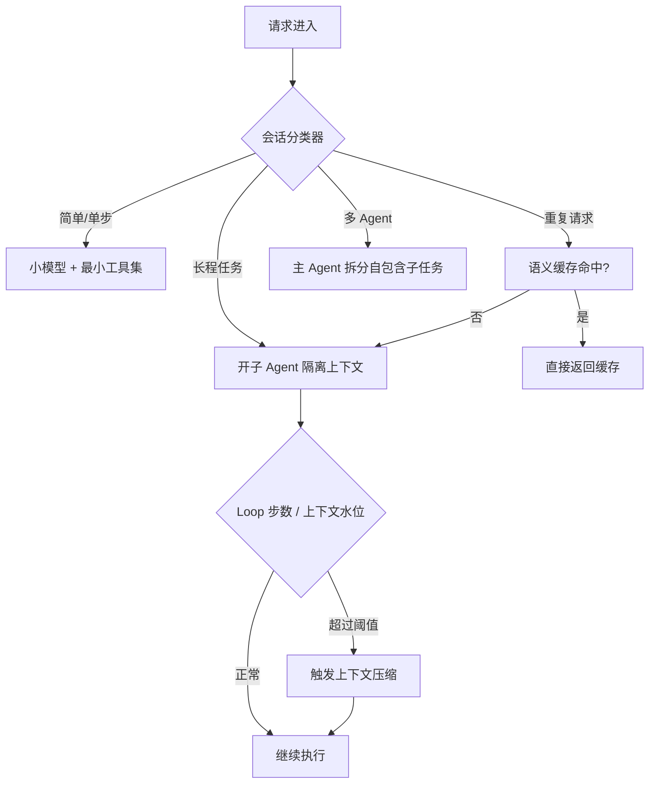
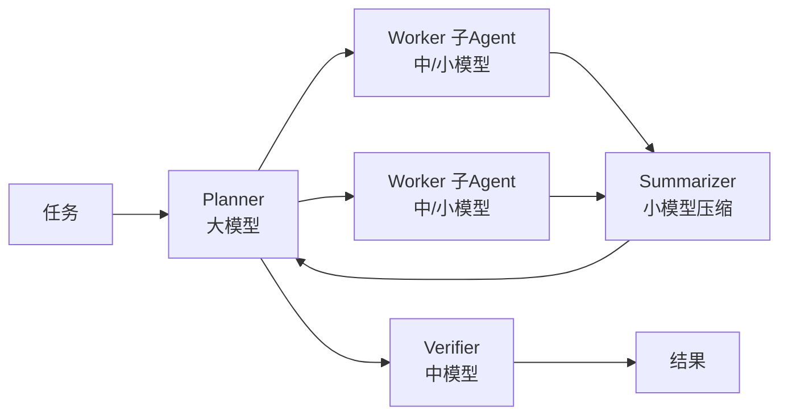
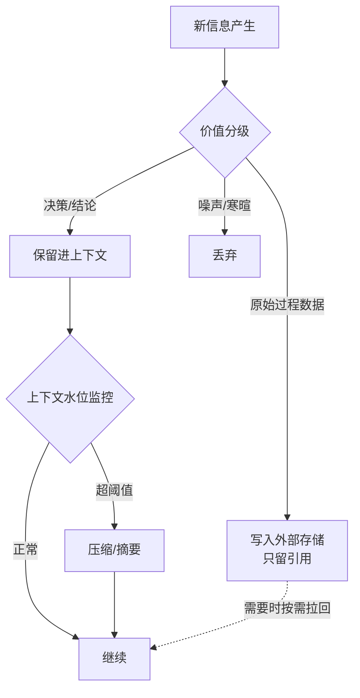
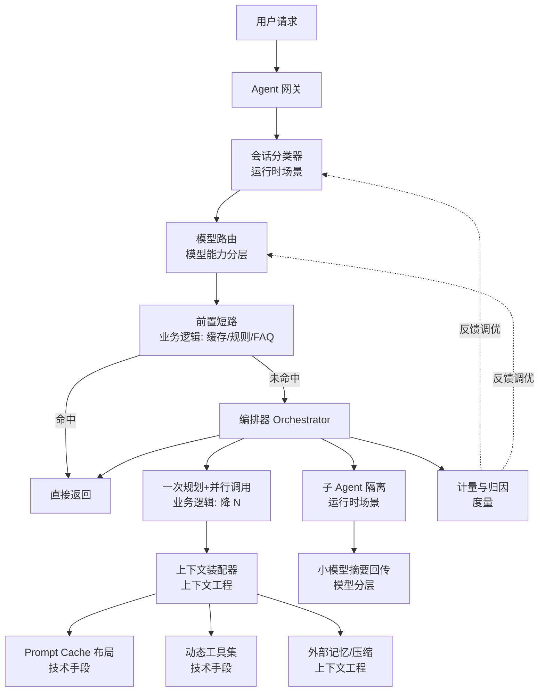
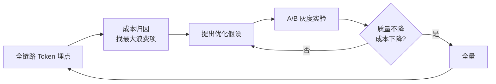

# 省 Token 的 Agent 架构设计：五维度技术方案

> 面向"如何系统性地降低 Agent 系统 Token 消耗"这一核心工程问题的完整技术方案。不是零散的 prompt 精简技巧，而是从 **运行时场景、技术手段、模型能力、业务逻辑、上下文管理** 五个维度构建一套可落地、可度量、可持续优化的架构体系。

## 目录

- [0. 为什么 Agent 比普通 LLM 应用更烧 Token](#0-为什么-agent-比普通-llm-应用更烧-token)
- [1. 成本模型：先量化，再优化](#1-成本模型先量化再优化)
- [2. 维度一：Agent 运行时场景分析](#2-维度一agent-运行时场景分析)
- [3. 维度二：技术手段](#3-维度二技术手段)
- [4. 维度三：模型能力分层](#4-维度三模型能力分层)
- [5. 维度四：业务逻辑优化](#5-维度四业务逻辑优化)
- [6. 维度五：上下文工程](#6-维度五上下文工程)
- [7. 整体架构：五维协同](#7-整体架构五维协同)
- [8. 关键代码实现](#8-关键代码实现)
- [9. 度量与持续优化](#9-度量与持续优化)
- [10. 落地路线图与避坑](#10-落地路线图与避坑)
- [11. 小结](#11-小结)

---

## 0. 为什么 Agent 比普通 LLM 应用更烧 Token

普通一次性问答（single-turn）的 Token 成本是线性的：一次输入 + 一次输出。而 Agent 系统的成本是**二次乃至指数增长**的，根源在于 Agent Loop 的结构：

```
Agent Loop 的第 N 步，模型看到的输入 =
    System Prompt (固定)
  + 工具定义 (固定，通常很大)
  + 历史所有轮次的 (思考 + 工具调用 + 工具返回结果)
  + 当前用户/环境输入
```

每多一步，前面所有步骤的上下文都要**重新完整地喂给模型一次**。这就是 Agent 烧 Token 的本质——**上下文的重复计费（re-billing）**。

```
单轮问答:        输入 T，成本 O(T)
10 步 Agent Loop: 每步累积，总成本 O(T × N²) 量级
```

| 成本放大来源 | 说明 | 典型占比 |
|------|------|----------|
| 历史累积 | 每步重放全部历史 | 40%~60% |
| 工具定义 | 几十个工具的 JSON Schema 每步都传 | 15%~30% |
| 冗长工具返回 | 一次文件读/搜索返回上万 token | 10%~25% |
| System Prompt | 长指令 + few-shot | 5%~15% |
| 多 Agent 协作 | 主子 Agent 上下文重复传递 | 视架构而定 |

> **核心洞察：省 Token 不是"把 prompt 写短一点"，而是治理"上下文如何随时间累积与重放"。**

---

## 1. 成本模型：先量化，再优化

优化前必须先建立成本归因，否则是盲目优化。定义单次会话的总成本：

```
Cost_total = Σ_step ( Cost_input(step) + Cost_output(step) )

Cost_input(step) = (P_uncached × price_in + P_cached × price_cached) + gen_prev + tools + sysprompt
```

其中关键杠杆参数：

| 参数 | 含义 | 优化维度 |
|------|------|----------|
| `N` | Loop 步数 | 业务逻辑 / 运行时场景 |
| `P_cached / P_uncached` | 命中缓存的输入占比 | 技术手段（Prompt Cache） |
| `price` | 单价（选哪个模型） | 模型能力分层 |
| `tools` | 工具定义体积 | 技术手段（动态工具集） |
| `history` | 历史累积体积 | 上下文工程 |

**归因优先级**：用一张"火焰图"式的 Token 分解报表，找出占比最高的一两项先打——通常是**历史累积**和**工具定义**，而不是大家第一反应去精简的 System Prompt。

```
一次真实会话的 Token 分解示例（12 步 Loop，总 480K input tokens）：
历史重放  ████████████████████  52%  ← 优先治理
工具定义  ████████              22%  ← 次优先
工具返回  ██████                16%
Sysprompt ███                    7%
本轮输入  █                      3%
```

---

## 2. 维度一：Agent 运行时场景分析

不同的运行时场景，Token 消耗特征完全不同，优化策略也应差异化。**先给会话分类，再套对应策略。**

### 2.1 场景分类

| 场景 | 特征 | Token 痛点 | 主打策略 |
|------|------|-----------|----------|
| **短平快问答** | 1~2 步结束 | 工具定义占比高 | 动态工具集、小模型直答 |
| **长程任务**（编码/研究） | 20~100+ 步 | 历史累积爆炸 | 上下文压缩、子 Agent 隔离、外部记忆 |
| **多 Agent 协作** | 主 + N 子 | 上下文重复传递 | 自包含子任务、结果摘要回传 |
| **高并发 SaaS** | 海量相似请求 | 重复计算 | Prompt Cache、语义缓存 |
| **交互式对话** | 多轮 human-in-loop | 对话历史增长 | 滑窗 + 摘要 |
| **后台批处理** | 无延迟要求 | 追求单位成本最低 | 批处理 API、离峰调度、小模型 |

### 2.2 运行时决策：什么时候该做什么



### 2.3 关键：长程任务的"子 Agent 上下文隔离"

长程任务最大的省 Token 手法，是把探索性、高 Token 消耗的子任务**下放给子 Agent**，子 Agent 在**独立上下文窗口**里烧完 Token，只把**精炼结论**回传给主 Agent。主 Agent 的上下文因此保持轻量。

```
❌ 单 Agent 做全部：主上下文里堆满 20 次文件搜索的原始返回 → 后续每步重放
✅ 主 Agent 派 explore 子 Agent：子 Agent 烧 200K token 探索，只回传 2K token 摘要
   主 Agent 上下文只增长 2K，而非 200K
```

> 这也是 Claude Code / Cursor 的 `Task`/subagent 机制省 Token 的根本原理：**用一次性的子进程 Token 换取主进程上下文的长期清洁。**

---

## 3. 维度二：技术手段

纯工程手段，与业务无关，通用性最强，应优先落地。

### 3.1 Prompt Caching（性价比最高，先做这个）

把上下文中**不变的前缀**（System Prompt + 工具定义 + few-shot）标记为可缓存，命中后这部分输入成本降 ~90%。

**关键工程约束：缓存是"前缀匹配"的，任何靠前的字节变化都会让后面全部失效。** 因此上下文必须按"稳定性"排序布局：

```
┌─────────────────────────────┐ ← 缓存区（放最前，永不变）
│ System Prompt               │
│ 工具定义 (Tool Schemas)     │
│ 稳定的 few-shot 示例        │
├─────────────────────────────┤ ← cache_control 断点
│ 会话历史（增量追加）        │  半稳定
├─────────────────────────────┤
│ 当前轮输入                  │  每次变化
└─────────────────────────────┘
```

反模式：把时间戳、随机 ID、动态排序的工具列表放在前面 → 缓存永远命中不了。

### 3.2 动态工具集（Deferred Tool Loading）

几十个工具的 JSON Schema 可能占几千甚至上万 token，且每步都传。做法：**按需暴露工具**，而非全量注册。

| 策略 | 做法 | 节省 |
|------|------|------|
| 工具分组 | 按任务阶段只加载相关组（读文件阶段不给部署工具） | 30%~60% 工具 token |
| 工具检索 | 用 embedding 从工具库检索 top-k 相关工具 | 大工具库场景显著 |
| 元工具（meta-tool） | 只暴露一个 `search_tools`，模型需要时再拉取定义 | 极致精简 |
| MCP 分层加载 | GetMcpTools 按需查 schema，而非全量注入 | 见本仓 deferred-loading 文档 |

#### 能力/Runtime 门控：用不到的工具集一个字节都别注入

工具定义占总 Token 的 15%~30%（本文 §1 示例 22%，是第二大头），所以"当前会话根本用不到的工具集"是最该先砍的浪费。注入某个工具集应同时满足三个条件，任一不满足就不注入：

```
注入某工具集 = 模型支持 tool calling
             ∧ runtime 接了该能力（MCP / Skill）
             ∧ 当前任务/阶段确实需要它
```

- **澄清一个误区**：严格说不存在"模型不支持 MCP"——MCP 工具最终以普通 function schema 喂给模型，任何会 tool-calling 的模型都能用。真正的情况是 *runtime 没接 MCP*、*模型根本不做 tool calling*、或 *本任务用不到*。无论哪种，结论一致：**用不到的 schema 不注入**。哪怕它在缓存前缀区，cached token 仍按 ~10% 计费，还白占上下文窗口、稀释注意力（Context Rot）。
- **MCP**：先只暴露 `GetMcpTools`/`search_tools`，模型要用时再拉具体 schema，而非几十个 MCP 工具全量注入。
- **Skill**：Skill 本质是"按需加载的指令文件"，天然应 lazy load（meta-tool 模式：只放一行"有哪些 skill + 触发时才读全文"），不该开局全量塞进 System Prompt。

### 3.3 工具返回值治理（最容易被忽视的大头）

工具返回是 Token 黑洞——一次 `grep`/文件读可能返回上万行。治理手段：

- **分页 + 截断**：默认只返回前 N 行/字符，附带 `has_more` 标志，模型需要再拉。
- **返回引用而非内容**：返回文件路径 + 行号范围，而非整段内容；模型真正需要时再定点读取。
- **服务端预处理**：搜索结果在返回前做去重、rerank、摘要，只回相关片段。
- **结构化压缩**：把冗长日志/JSON 压成结构化摘要（保留 error/关键字段，丢弃噪声）。

```
❌ read_file 返回整个 2000 行文件 → 20K tokens，之后每步重放
✅ read_file 返回目标函数 ±20 行 + "文件共 2000 行，用 offset 读取更多" → 800 tokens
```

### 3.4 结构化输出替代自然语言

- 用 JSON/枚举替代自由文本，输出 token 更少且可解析。
- 约束模型"只输出 diff / 只输出变更字段"，而非重复整个文件（对应本仓 ai-code-diff-control）。

### 3.5 批处理与离峰

无实时要求的任务走 Batch API（多数厂商 5 折），并发聚合请求摊薄固定开销。

---

## 4. 维度三：模型能力分层

不是所有步骤都需要最强模型。**用"最便宜的能胜任模型"完成每一步**，是数量级级别的省钱。

### 4.1 模型路由（Model Router）

```
              ┌─ 分类/提取/格式化/意图识别 → 小模型 (Haiku/Flash 级, ~$0.25/M)
请求/子任务 ──┼─ 生成/常规编码/分析        → 中模型 (Sonnet 级, ~$3/M)
              └─ 复杂推理/架构/长程规划     → 大模型 (Opus 级, ~$15/M)
```

路由依据：任务类型关键词、输入长度、是否需多步推理、置信度阈值（低置信升级到大模型）。

### 4.2 Agent Loop 内的异构模型

同一个 Loop 内不同角色用不同模型，这是 Agent 特有的省钱点：

| 角色 | 任务 | 建议模型 |
|------|------|----------|
| Planner / Orchestrator | 拆解、决策 | 大模型（决策质量决定全局） |
| Worker / 执行子 Agent | 具体工具调用 | 中/小模型 |
| Summarizer / Compressor | 压缩历史、摘要工具返回 | 小模型（batch） |
| Router / Classifier | 意图分类 | 极小模型 / 规则引擎 |
| Verifier / Critic | 校验结果 | 中模型 |



### 4.3 级联（Cascade）与推测执行

- **级联**：先让小模型试答，置信度低或校验不通过时才升级到大模型。80% 请求止步于小模型。
- **利用推理模型的自适应**：需要深度推理时才开启 thinking / extended reasoning，简单任务关闭，避免为不需要的思考付费。

### 4.4 换模型时的 Prompt 瘦身：能砍什么、不能砍什么

模型能力提升后，为弱模型调的 System Prompt 往往"过度规格化"，可以精简——但要分清两类内容，能力提升只对第一类有效：

| 内容类型 | 举例 | 强模型能否砍 |
|---|---|---|
| **教学性内容** | few-shot 示例、step-by-step 手把手、反复强调、防御性话术 | ✅ 能砍。强模型指令遵循好、少样本泛化强，示例可去掉一大半 |
| **规格性内容** | 有哪些工具、输出格式约束、业务规则、安全红线、角色边界 | ❌ 不能砍。与模型强弱无关，是"契约"，砍了行为就跑偏 |

两个反直觉但关键的点：

- **ROI 有限**：System Prompt 只占 5%~15%（§1 示例 7%），且在缓存前缀区（命中后按 ~10% 计费）。砍一半对总成本影响也是个位数百分比——属于锦上添花，排序应在历史累积、工具定义之后（呼应 §10.2「只优化 System Prompt」这个坑）。
- **必须灰度验收**：换模型后删指令要用双指标（成本 ↓ 且 质量不降）A/B 验证，否则容易踩「省 prompt 反而返工更贵」的坑。

### 4.5 端侧 / 小模型前置

意图识别、敏感词过滤、简单分类可放到端侧或本地小模型，根本不进云端大模型（参考本仓端侧 AI 系列）。

---

## 5. 维度四：业务逻辑优化

很多 Token 是被"糟糕的业务流程设计"浪费的，改流程比改 prompt 效果大得多。

### 5.1 减少不必要的 Loop 步数（N 是平方项，最值钱）

- **一次规划，批量执行**：让模型一次性输出完整计划（parallel tool calls），而非"想一步做一步"来回 N 轮。
- **并行工具调用**：无依赖的工具在同一轮并发调用，把 N 步压成 1 步。
- **提前终止（fuse）**：设置 max steps、无进展检测、预算熔断（参考本仓 agent-loop-three-fuses）。
- **确定性任务不要用 Agent**：能用规则/代码/普通 API 解决的，绝不进 LLM。这是最大的省 Token——**该省的是整次调用**。

```
❌ 让 Agent 逐个文件循环调用"读取→判断→下一个"，10 文件 = 20+ 步
✅ 一轮并发读 10 文件 + 一轮批量判断 = 2 步
```

### 5.2 用代码/工具承接确定性逻辑

LLM 只做"不确定的决策"，确定性计算（排序、过滤、格式转换、聚合）交给工具/代码执行，不让模型在上下文里"用文字算"。

### 5.3 前置校验与短路

- 输入合法性、权限、去重在进入 Agent 前用普通代码拦截。
- 常见问题走 FAQ / 规则库直接命中，不进 Agent。

### 5.4 任务分解粒度

子任务粒度过细 → 编排 overhead 大、上下文重复传递多；过粗 → 单次上下文膨胀。找平衡点（参考本仓 task-decomposition-granularity）。**自包含子任务**：每个子任务携带完成它所需的最小上下文，不依赖主上下文全量传递。

### 5.5 用户体验层的抑制

- 防抖/合并用户的连续输入，避免每个字符触发一次 Agent。
- 流式输出 + 早停：用户满意可随时中断，不跑完全程。

---

## 6. 维度五：上下文工程

这是 Agent 省 Token 的**主战场**（历史累积占比最高）。核心是治理"上下文随时间如何增长"。

### 6.1 上下文生命周期管理



### 6.2 历史压缩策略

| 策略 | 做法 | 压缩率 | 代价 |
|------|------|--------|------|
| 滑动窗口 | 只留最近 N 轮 | 高 | 丢失早期信息 |
| 摘要替换 | 每 N 轮用小模型把旧历史压成摘要 | 高 | 一次小模型成本 |
| 关键信息提取 | 只留实体/决策/文件路径/结论 | 最高 | 需要抽取逻辑 |
| 分层记忆 | 近期原文 + 中期摘要 + 远期外存 | 平衡 | 实现复杂 |

**Agent 特化的压缩：Loop 中间的"工具调用—返回"对**，一旦其结论被后续步骤消化，就可把原始返回替换为一句摘要（"已读取 X，关键结论 Y"）。

### 6.3 外部记忆（Memory / Scratchpad）

把上下文当"CPU 寄存器"（贵、稀缺），把外部存储当"磁盘"：

- **Scratchpad / 文件系统**：中间产物写文件，上下文只留路径。Agent 需要时再读。
- **向量记忆**：长期知识存向量库，按需检索 top-k，而非全塞进上下文。
- **结构化状态**：用一个精简的 state 对象承载"当前进度/已知事实"，替代重放全部历史（参考本仓 multi-agent-state-passing）。

```
❌ 20 步的所有工具返回都留在上下文 → 第 20 步重放 20 份原始数据
✅ 中间产物落盘，上下文维护一个 "已完成清单 + 关键结论 + 文件引用" 的 state
```

### 6.4 RAG 精准化（少而准）

- 召回后 **rerank**，只送最相关 2~3 条，而非 top-20 全塞。
- 送**摘要 + 引用**，原文按需拉取。
- 控制 chunk 粒度，避免无关段落搭车进上下文。

### 6.5 上下文布局与 Context Rot 治理

- 稳定内容靠前（配合 Prompt Cache），易变内容靠后。
- 及时清理无效/过时上下文，避免 Context Rot 导致模型注意力涣散、反而多轮纠错烧更多 token（参考本仓 system-prompt-engineering-and-context-rot）。

---

## 7. 整体架构：五维协同

五个维度不是孤立的，落在一套统一架构里各司其职：



| 维度 | 在架构中的落点 | 一句话职责 |
|------|--------------|-----------|
| 运行时场景 | 会话分类器 + 子 Agent 隔离 | 给会话分类，长程任务隔离上下文 |
| 技术手段 | Prompt Cache + 动态工具 + 返回治理 | 通用降本，与业务无关 |
| 模型能力 | 模型路由 + 异构 Loop | 每步用最便宜的够用模型 |
| 业务逻辑 | 前置短路 + 降 N + 确定性外包 | 从源头减少 LLM 调用 |
| 上下文工程 | 装配器 + 压缩 + 外部记忆 | 治理历史累积（最大头） |

---

## 8. 关键代码实现

### 8.1 Token 计量与成本归因

```typescript
interface StepCost {
  step: number;
  model: string;
  inputTokens: number;
  cachedTokens: number;   // 命中缓存部分
  outputTokens: number;
  breakdown: {            // 输入 token 归因
    sysPrompt: number;
    tools: number;
    history: number;
    toolResults: number;
    current: number;
  };
}

function costOf(s: StepCost, price: Record<string, { in: number; cached: number; out: number }>) {
  const p = price[s.model];
  const uncached = s.inputTokens - s.cachedTokens;
  return (uncached * p.in + s.cachedTokens * p.cached + s.outputTokens * p.out) / 1_000_000;
}

// 会话结束时输出火焰图式归因，定位最大浪费项
function attribute(session: StepCost[]) {
  const agg = { sysPrompt: 0, tools: 0, history: 0, toolResults: 0, current: 0 };
  for (const s of session) for (const k in agg) agg[k] += s.breakdown[k];
  return Object.entries(agg).sort((a, b) => b[1] - a[1]); // 降序，第一项优先治理
}
```

### 8.2 会话分类 + 模型路由

```typescript
type Scene = "simple" | "long_task" | "multi_agent" | "repeat" | "chat";

function classify(req: Request): Scene {
  if (semanticCache.has(req)) return "repeat";
  if (req.needsMultiStep && req.estimatedSteps > 15) return "long_task";
  if (req.subTasks?.length > 1) return "multi_agent";
  if (!req.needsMultiStep && req.inputTokens < 2000) return "simple";
  return "chat";
}

function routeModel(task: Task): string {
  if (task.type === "classify" || task.type === "extract") return "haiku";
  if (task.type === "plan" || task.complexity === "high") return "opus";
  return "sonnet";
}
```

### 8.3 上下文水位监控与自动压缩

```typescript
class ContextManager {
  private budget: number;           // 上下文 token 预算
  private threshold = 0.7;          // 到 70% 触发压缩

  async assemble(history: Message[], sys: string, tools: Tool[]): Promise<Message[]> {
    let ctx = [sys, ...history];
    if (tokens(ctx) > this.budget * this.threshold) {
      ctx = await this.compress(history, sys);
    }
    return ctx;
  }

  // 用小模型把旧历史压成摘要，工具返回替换为结论
  private async compress(history: Message[], sys: string): Promise<Message[]> {
    const [recent, old] = split(history, /* keep last */ 6);
    const summary = await smallModel.summarize(old, {
      keep: ["decisions", "entities", "file_refs", "conclusions"],
      drop: ["raw_tool_output", "chitchat"],
    });
    return [sys, { role: "system", content: `历史摘要:\n${summary}` }, ...recent];
  }
}
```

### 8.4 工具返回值治理（分页 + 引用）

```typescript
function truncateToolResult(result: string, opts = { maxTokens: 1500 }) {
  if (tokens(result) <= opts.maxTokens) return { content: result, hasMore: false };
  return {
    content: head(result, opts.maxTokens),
    hasMore: true,
    hint: `结果过长，已截断。使用 offset/filter 获取更多（总计 ~${tokens(result)} tokens）`,
  };
}

// 返回引用而非全文
function readFileSmart(path: string, target?: { line: number }) {
  if (target) return { path, range: [target.line - 20, target.line + 20], content: slice(path, target) };
  return { path, totalLines: lineCount(path), hint: "指定 line 或 range 以读取具体片段" };
}
```

### 8.5 Prompt Cache 感知的上下文布局

```typescript
// 严格按稳定性排序，稳定前缀打 cache 断点
function buildMessages(ctx: Ctx) {
  return [
    { role: "system", content: ctx.systemPrompt, cache_control: { type: "ephemeral" } }, // 永不变
    { role: "system", content: ctx.toolDefs,     cache_control: { type: "ephemeral" } }, // 工具定义
    ...ctx.history,   // 半稳定，增量追加，不重排
    { role: "user", content: ctx.currentInput }, // 每次变化，放最后
  ];
}
```

### 8.6 子 Agent 隔离 + 摘要回传

```typescript
async function delegate(task: SubTask, mainCtx: Context): Promise<string> {
  // 子 Agent 用独立上下文窗口，不污染主上下文
  const sub = new Agent({
    model: routeModel(task),
    context: buildSelfContained(task),   // 仅注入完成任务所需最小上下文
    tools: relevantTools(task),          // 动态工具子集
  });
  const fullResult = await sub.run();    // 子 Agent 内部可烧大量 token

  // 关键：只把精炼摘要回传主 Agent，主上下文只增长这一点
  return await smallModel.summarize(fullResult, { maxTokens: 1500 });
}
```

---

## 9. 度量与持续优化

省 Token 是一个"可观测 → 归因 → 优化 → 回归验证"的闭环，不是一次性动作。

### 9.1 核心指标

| 指标 | 定义 | 目标 |
|------|------|------|
| **Tokens per Task** | 完成单个任务的总 token | 持续下降 |
| **Cache Hit Rate** | 缓存命中 token / 总输入 token | > 60% |
| **Steps per Task** | 平均 Loop 步数 | 下降 |
| **Cost per Task** | 单任务美元成本 | 下降 |
| **Small Model Ratio** | 走小模型的调用占比 | > 50% |
| **Context Utilization** | 有效上下文 / 已用上下文 | 越高越好 |

### 9.2 优化闭环



> **红线：省 Token 不能牺牲任务成功率。** 每次优化必须同时监控"任务成功率/质量分"，用双指标（成本 ↓ 且 质量持平）作为通过标准。可参考本仓 ai-observability 与 ai-gateway-metering-billing 文档搭建计量底座。

---

## 10. 落地路线图与避坑

### 10.1 分阶段落地（按 ROI 排序）

| 阶段 | 动作 | ROI | 风险 |
|------|------|-----|------|
| P0 | Token 埋点 + 成本归因报表 | 前置必做 | 低 |
| P0 | Prompt Cache（稳定前缀布局） | 极高 | 低 |
| P1 | 工具返回值治理（分页/截断/引用） | 高 | 低 |
| P1 | 模型路由（简单任务下沉小模型） | 高 | 中（需评测质量） |
| P2 | 上下文压缩 + 外部记忆 | 高（长程任务） | 中 |
| P2 | 动态工具集 | 中 | 中 |
| P3 | 子 Agent 隔离 + 异构 Loop | 高（复杂任务） | 高 |
| P3 | 语义缓存 / 级联 | 中 | 中 |

### 10.2 常见坑

| 坑 | 后果 | 规避 |
|------|------|------|
| 前缀里放动态内容（时间戳/随机 ID） | Prompt Cache 永不命中 | 动态内容一律靠后 |
| 过度压缩历史 | 丢关键信息，模型反复试错，**反而更贵** | 分级压缩，保留决策/事实 |
| 小模型路由无质量兜底 | 简单任务答错，返工烧更多 token | 置信度校验 + 失败升级 |
| 只优化 System Prompt | 治标不治本（它占比最小） | 先打历史累积和工具定义 |
| 无限 Loop 无熔断 | 单次会话烧穿预算 | max steps + 预算熔断 + 无进展检测 |
| 子 Agent 回传全量结果 | 隔离失效，主上下文照样爆 | 强制摘要回传 |
| 为省钱牺牲成功率 | 返工/人工介入，总成本更高 | 双指标（成本+质量）门禁 |

---

## 11. 小结

省 Token 的 Agent 架构，本质是**对"上下文如何随时间累积与重放"的系统性治理**，而不是零散的 prompt 精简技巧。五个维度的分工与优先级：

1. **上下文工程**是主战场（历史累积占比最高）——压缩、外部记忆、精准 RAG。
2. **业务逻辑**决定 N（平方项最值钱）——降步数、并行、确定性外包、前置短路。
3. **技术手段**通用降本先落地——Prompt Cache、动态工具集、工具返回治理。
4. **模型能力分层**是数量级省钱——路由 + 异构 Loop，每步用够用的最便宜模型。
5. **运行时场景**驱动策略选择——先分类，长程任务用子 Agent 隔离上下文。

> **一句话原则：先量化归因，再按 ROI 出手；打最大的那块（历史累积 + 工具定义），而不是最显眼的那块（System Prompt）；每一步优化都用"成本↓且质量不降"双指标验收。**

**相关文档**：
- [application-layer-token-optimization.md](./application-layer-token-optimization.md) — 应用层 Token 优化基础策略
- [cache-explained-and-cost-control.md](../docs/cache-explained-and-cost-control.md) — KV/Prompt Cache 与成本控制
- [context-management-system-practical-guide.md](../docs/context-management-system-practical-guide.md) — 上下文管理系统实战
- [deferred-loading-and-dynamic-toolset.md](../docs/deferred-loading-and-dynamic-toolset.md) — 动态工具集
- [agent-loop-three-fuses.md](../docs/agent-loop-three-fuses.md) — Loop 熔断与预算治理
- [dynamic-subagent-creation-and-scheduling.md](../1.multi-agent/dynamic-subagent-creation-and-scheduling.md) — 子 Agent 动态调度
