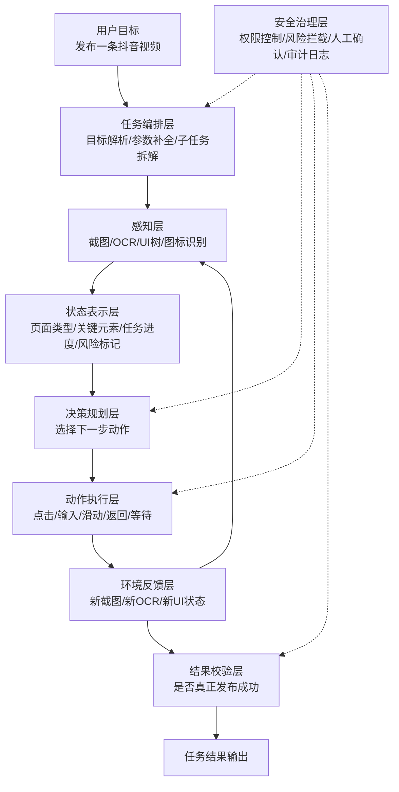
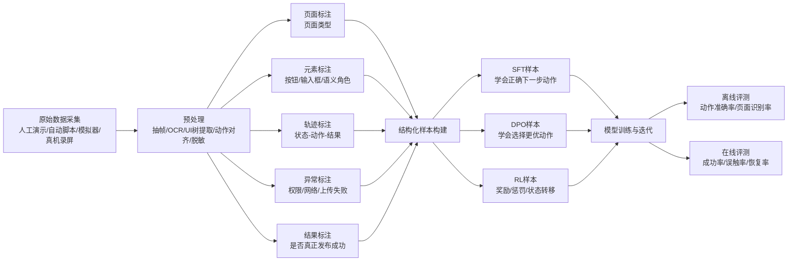
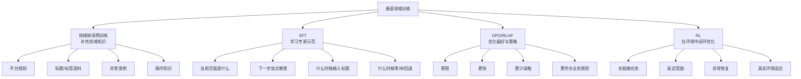
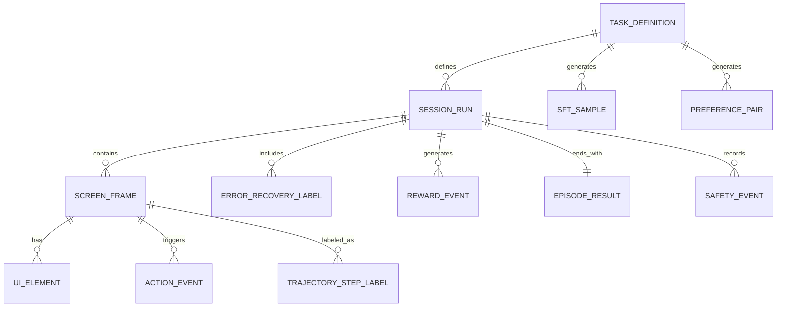

# 垂直领域大模型训练：以手机抖音视频发布 Agent 为例

## 一、什么是垂直领域训练

垂直领域训练，本质上是让通用大模型在某个特定行业、任务或环境中具备更强的理解、决策和执行能力。

它通常不只是“让模型更懂某个行业”，而是同时解决 3 类问题：

1. 领域知识问题
2. 任务能力问题
3. 环境交互问题

如果以“让大模型操作手机抖音 App 完成视频发布”为例，那么训练目标已经不再是“会聊天”，而是：

- 看懂当前手机界面
- 理解用户任务目标
- 规划正确操作步骤
- 执行点击、输入、滑动等动作
- 遇到异常能够恢复
- 最终成功完成发布

---

## 二、垂直领域训练的主要方法

垂直领域训练一般可以拆成 4 个主要层次：

### 1. 领域继续预训练

目标是让模型补充垂直领域知识。

训练数据可以包括：

- 领域文档
- 行业规则
- FAQ
- 操作手册
- 历史案例
- 平台规范

以抖音发布视频场景为例，可加入：

- 抖音创作者规则
- 标题、话题、文案语料
- 视频发布流程说明
- 视频审核规则
- 常见上传失败原因
- 手机 UI 操作说明

这一层解决的是：
`模型懂不懂这个领域。`

### 2. SFT（监督微调）

目标是让模型学会具体任务。

SFT 的核心是“输入 -> 标准输出”的专家示范数据。

对于手机 Agent，不是普通问答，而是：

- 当前任务目标
- 当前屏幕截图
- OCR 文字
- UI 元素
- 历史步骤
- 正确下一步动作

例如：

- 输入：当前已经到抖音发布设置页，标题为空
- 输出：点击标题输入框，输入指定文案

这一层解决的是：
`模型会不会做这个任务。`

### 3. DPO / RLHF（偏好对齐）

目标是让模型不只是“能做”，而是“做得更好”。

比如同一个页面下有两种操作：

- A：直接点击发布
- B：先检查标题和权限设置，再点击发布

如果 B 更稳、更符合业务规则，就通过偏好学习让模型更倾向选择 B。

这一层解决的是：
`模型做得好不好。`

### 4. RL（强化学习）

目标是让模型在真实环境中具备长链路决策和异常恢复能力。

因为操作手机 App 是一个典型的时序决策问题：

- 当前动作会影响后续页面
- 奖励经常延迟到最后才出现
- 错误操作会导致任务失败
- 很多异常需要试探和恢复

例如奖励可以设计为：

- 成功进入目标页面：`+1`
- 成功填写标题：`+1`
- 成功发布：`+10`
- 误触退出：`-3`
- 发布失败：`-5`
- 点击高风险按钮：`-10`

这一层解决的是：
`模型能不能在真实环境里闭环完成任务。`

---

## 三、垂直领域训练常见的数据标注方式

很多人会说“做文本标注、图片标注”，但对于垂直 Agent 来说，这还不够。真正有效的训练数据通常包括以下几类。

### 1. 文本标注

适用于知识理解、意图识别、规则学习。

常见形式：

- 分类标注
- 实体标注
- 意图标注
- 问答标注
- 规则标注

例如：

- “帮我发一个探店视频” -> 意图：发布视频
- “标题里加杭州咖啡馆” -> 实体：标题关键词
- “只自己可见” -> 隐私设置意图

### 2. 图片标注

适用于界面理解和控件识别。

常见形式：

- 框选按钮、输入框、弹窗
- 标注控件类型
- 标注控件语义
- 标注控件状态

例如在抖音发布页中：

- 标注“发布”按钮位置
- 标注“添加作品描述”输入框
- 标注“谁可以看”设置项
- 标注按钮是否可点击

### 3. OCR + 语义标注

很多信息不在图片结构，而在文字本身。

例如：

- OCR 识别：“上传中 87%”
- 语义标签：上传进度
- 决策含义：当前应该等待，不应该继续点击

### 4. 动作轨迹标注

这是手机 Agent 最关键的数据之一。

一条轨迹通常包括：

- 当前状态
- 当前截图
- 当前 OCR / UI 树
- 正确动作
- 动作后的新状态
- 是否成功推进任务

例如：

- 当前页面：相册选择页
- 正确动作：点击目标视频
- 下一状态：视频编辑页

### 5. 推理说明标注

不是只标“做什么”，还要标“为什么这么做”。

例如：

- 当前页面是发布设置页
- 标题为空
- 发布按钮虽然可见，但直接发布风险高
- 所以先填写标题

实际工程中，不一定要存很长的思维链，更推荐短标签化：

- `need_fill_required_field`
- `need_wait_upload`
- `need_handle_popup`
- `ready_to_publish`

### 6. 异常恢复标注

真实手机操作里异常很多，比如：

- 权限弹窗
- 网络错误
- 上传失败
- 内容违规提示
- App 改版
- 广告弹窗
- 系统通知遮挡

需要专门标：

- 异常类型
- 严重程度
- 恢复策略
- 是否需要人工确认
- 是否成功恢复

### 7. 结果标注

最后必须判断任务是不是真的完成。

例如：

- 是否成功进入发布成功页
- 是否真的出现在个人主页
- 标题是否正确
- 隐私设置是否正确
- 是否发布到了错误账号

---

## 四、为什么“文本标注 + 图片标注”还不够

因为手机 Agent 不只是“识别”，而是“时序决策”。

核心难点有 5 个：

### 1. 强时序依赖

当前动作是否正确，依赖之前做过什么。

比如：

- 是否已经选过视频
- 是否已经填写标题
- 是否已经设置过权限

### 2. 同一按钮语义会变

“下一步”按钮在不同页面语义不同。

### 3. 纯坐标没有泛化性

点击 `(x, y)` 只是物理动作，不是语义动作。真正需要学的是“点击发布按钮”，而不是“点击某个像素点”。

### 4. UI 会变化

App 一升级，按钮位置和样式可能变化。如果模型只记坐标，很容易失效。

### 5. 真实环境有大量噪声

包括：

- 网络抖动
- 弹窗打断
- 权限请求
- 页面加载慢
- 版本变化
- 通知栏遮挡

因此，要训练出可用的垂直 Agent，必须从“静态标注”升级到“状态-动作-结果”级别的轨迹监督。

---

## 五、以“抖音发布视频”为例拆解完整能力

如果目标是训练一个“会操作抖音发布视频”的垂直 Agent，可以把能力拆成 5 层：

1. 界面理解
2. 操作规划
3. 单步执行
4. 异常恢复
5. 结果校验

对应子任务可以包括：

- 打开抖音
- 进入发布入口
- 选择相册视频
- 视频编辑或裁剪
- 输入标题和话题
- 设置隐私权限
- 点击发布
- 校验是否发布成功

---

## 六、系统总体架构

这类系统通常不会只靠一个大模型端到端完成，而会采用分层架构。

### 1. 感知层

负责看懂当前界面。

输入：

- 屏幕截图
- OCR
- UI 树
- 图标识别结果

输出：

- 当前页面类型
- 可交互元素
- 元素语义
- 当前页面状态

例如识别：

- 当前是发布设置页
- 有标题输入框
- 有“发布”按钮
- 当前存在上传中的状态提示

### 2. 状态表示层

把感知层输出整理成结构化状态，便于决策层使用。

例如整理成：

- 当前任务目标
- 当前页面类型
- 当前任务进度
- 当前可交互元素
- 当前阻塞问题
- 当前风险标记

### 3. 决策规划层

负责决定下一步该做什么。

输出内容一般包括：

- 动作类型
- 目标元素
- 动作参数
- 是否结束任务

例如：

- 点击相册入口
- 输入标题文本
- 等待上传
- 返回上一步
- 终止并请求用户确认

### 4. 动作执行层

负责把“语义动作”转成真实手机操作。

原子动作包括：

- 点击
- 输入
- 清空
- 滑动
- 返回
- 等待
- 确认 / 取消

### 5. 环境反馈层

执行动作后重新获取新状态。

例如：

- 页面跳转成功
- 出现新弹窗
- 上传进度变化
- 动作未生效

形成闭环：

`观察 -> 决策 -> 执行 -> 反馈 -> 再观察`

### 6. 结果校验层

负责判断任务是不是真的成功完成。

例如：

- 是否真正发布成功
- 是否出现在个人主页
- 标题是否符合预期
- 隐私设置是否正确

### 7. 安全治理层

这是企业落地中很重要的一层。

主要负责：

- 权限控制
- 风险拦截
- 关键动作人工确认
- 全链路审计

例如禁止：

- 自动确认敏感授权
- 误删内容
- 错误账号发布
- 越权跳转到非目标页面

---

## 七、系统总体架构图



---

## 八、训练数据流设计

训练数据不能只是一堆截图或问答，而要有完整的数据生产链路：

1. 原始采集
2. 预处理
3. 标注
4. 样本构建
5. 训练
6. 评测



---

## 九、训练方法的分工



可以把它们分别理解成：

- 预训练：补知识
- SFT：教学会
- DPO：调更优
- RL：做闭环

---

## 十、训练数据表结构设计

如果从工程实现角度看，一般会设计成多表模型，而不是一张大表。

推荐核心表如下：

- `task_definition`
- `session_run`
- `screen_frame`
- `ui_element`
- `action_event`
- `trajectory_step_label`
- `preference_pair`
- `reward_event`
- `episode_result`
- `safety_event`

### 1. task_definition

定义任务模板，例如“发布视频”。

### 2. session_run

记录一次完整执行过程，可以是人工演示、脚本执行或 Agent 执行。

### 3. screen_frame

记录每一帧界面，包括截图、OCR、UI 树、页面类型。

### 4. ui_element

记录当前帧中的关键元素，例如按钮、输入框、设置项。

### 5. action_event

记录该步执行了什么动作，例如点击、输入、滑动。

### 6. trajectory_step_label

记录某一步的标准答案，也就是“当前状态下正确下一步动作是什么”。

### 7. preference_pair

记录同一状态下两个可行动作，哪个更优，用于 DPO。

### 8. reward_event

记录强化学习中的奖励与惩罚。

### 9. episode_result

记录一次完整任务的最终结果。

### 10. safety_event

记录风险事件，例如误触、越权、敏感操作等。

---

## 十一、ER 图风格关系图



一句话记忆：

`任务 -> 会话 -> 帧 -> 元素 -> 动作 -> 标签 -> 偏好 -> 奖励 -> 结果 -> 风险`

---

## 十二、SFT 样本设计示例

SFT 样本本质上是：
`当前状态 -> 正确下一步动作`

```json
{
  "sample_id": "sft_000001",
  "task_id": "douyin_publish_v1",
  "frame_id": "frame_000128",
  "input": {
    "goal": "发布一条宠物视频到抖音，标题包含今天也太可爱了，公开可见",
    "page_type": "publish_settings_page",
    "ocr_text": [
      "添加作品描述",
      "谁可以看",
      "发布"
    ],
    "history": [
      "已打开抖音",
      "已选择视频",
      "已进入发布页"
    ],
    "ui_elements": [
      {
        "element_id": "title_input",
        "semantic_role": "title_input",
        "type": "input"
      },
      {
        "element_id": "publish_button",
        "semantic_role": "publish",
        "type": "button"
      }
    ],
    "blocking_issue": "title_empty"
  },
  "output": {
    "thought_tag": "need_fill_required_field",
    "action_type": "input_text",
    "target_element_id": "title_input",
    "action_args": {
      "text": "今天也太可爱了 #萌宠 #治愈日常"
    },
    "done": false
  }
}
```

---

## 十三、DPO 样本设计示例

DPO 样本本质上是：
`同一状态下，两个可行答案里哪个更优`

```json
{
  "pair_id": "dpo_000001",
  "task_id": "douyin_publish_v1",
  "frame_id": "frame_000128",
  "input": {
    "goal": "发布一条宠物视频到抖音，标题包含今天也太可爱了，公开可见",
    "page_type": "publish_settings_page",
    "ocr_text": [
      "添加作品描述",
      "谁可以看",
      "发布"
    ],
    "history": [
      "已打开抖音",
      "已选中视频",
      "已进入发布页"
    ],
    "blocking_issue": "title_empty"
  },
  "chosen": {
    "thought_tag": "need_fill_required_field",
    "action_type": "input_text",
    "target_element_id": "title_input",
    "action_args": {
      "text": "今天也太可爱了 #萌宠 #治愈日常"
    }
  },
  "rejected": {
    "thought_tag": "ready_to_publish",
    "action_type": "tap",
    "target_element_id": "publish_button"
  },
  "preference_reason": "先补全必填字段更稳妥，能降低发布失败率"
}
```

一句话区分：

- SFT：教模型“正确答案是什么”
- DPO：教模型“两个答案里哪个更好”

---

## 十四、评测指标设计

训练完成后，不能只看 loss，还要看真实任务效果。

### 离线指标

- 页面识别准确率
- 元素识别准确率
- 下一步动作准确率
- 异常识别准确率
- 轨迹匹配率

### 在线 / 仿真指标

- 任务成功率
- 平均完成步数
- 平均完成时长
- 异常恢复成功率
- 误触率
- 卡死率

### 业务指标

- 是否真正发布成功
- 标题是否正确
- 隐私设置是否正确
- 是否发布到正确账号
- 安全违规率

---

## 十五、真实落地中的推荐路线

如果真的做这个项目，比较现实的路线通常是：

### 第一阶段：界面理解能力建设

重点做：

- 页面分类
- OCR 语义理解
- UI 元素识别
- 页面结构化表示

### 第二阶段：SFT 冷启动

重点做：

- 收集人工演示轨迹
- 标注单步动作
- 训练基础操作策略

### 第三阶段：偏好优化

重点做：

- 多路径比较
- 稳定性优化
- 风险行为抑制
- 更符合业务规则的策略学习

### 第四阶段：RL 闭环强化

重点做：

- 长链路任务成功率
- 异常恢复能力
- 动态环境适应
- 延迟奖励优化

### 第五阶段：安全与治理

重点做：

- 关键动作确认
- 风险拦截
- 日志审计
- 灰度发布
- 在线评测

---

## 十六、面试时的回答模板

如果面试官问“垂直领域大模型怎么训练”，可以按下面逻辑回答：

第一，我会先区分知识、任务和环境三层。知识层通过领域继续预训练补充行业术语、规则和案例；任务层通过 SFT 学专家示范；环境层通过 RL 提升在真实环境中的闭环执行能力。

第二，如果场景是手机抖音视频发布，我不会只做文本和图片标注，而会重点构建轨迹数据，包括任务目标、截图、OCR、UI 元素、历史步骤、正确动作和最终结果。因为这本质上是状态驱动的时序决策问题，而不是普通问答。

第三，在系统架构上，我会拆成感知层、状态表示层、决策规划层、动作执行层、结果校验层和安全治理层。感知层看懂界面，决策层选择动作，执行层调用自动化能力，校验层判断是否真正发布成功，安全层负责权限控制和风险拦截。

第四，在训练策略上，我会先用 SFT 做冷启动，再用 DPO 优化路径选择，最后在模拟器或真机环境中用 RL 做长链路和异常恢复优化。

第五，在评测上，我不仅看动作准确率，还会看任务成功率、平均步数、恢复率和安全违规率。

---

## 十七、总结

垂直领域训练不等于“喂更多行业文本”。

真正有效的垂直领域训练，一般是：

- 用领域继续预训练补知识
- 用 SFT 补任务能力
- 用 DPO / RLHF 做偏好优化
- 用 RL 做环境闭环优化
- 用分层架构和数据模型支撑工程落地
- 用评测和安全治理保证真实可用

如果以“操作手机抖音发布视频”为例，最关键的数据并不是普通文本，而是：

- 真机或模拟器操作轨迹
- 屏幕截图 + OCR + UI 元素
- 正确下一步动作
- 异常恢复样本
- 最终发布成功标签

一句话总结：

`垂直领域大模型训练 = 领域知识训练 + 任务轨迹训练 + 偏好优化 + 环境交互强化 + 评测治理闭环。`
